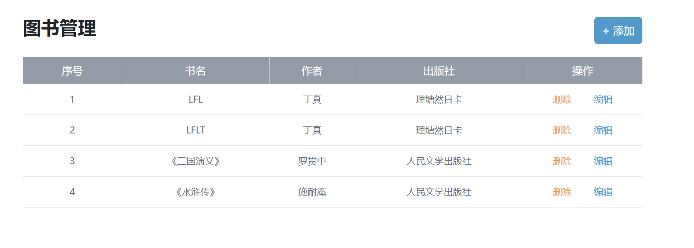

# 	Ajax


# 基本概念

概念：是浏览器与服务器进行**数据通信**的技术 Ajax具有**异步**特性 可以在**不刷新页面**的情况下**与服务器通信 交换数据 或更新页面**


一般使用axios库实现Ajax技术


**请求是异步的**


# Axios使用

在线引入Ajax库

```javascript
<script src="https://cdn.jsdelivr.net/npm/axios/dist/axios.min.js"></script>
```


先传入**配置对象** 然后用**then回调函数**接收结果 做**后续处理** 回调函数中的**第一个参数是服务端返回结果**


# URL

统一资源定位符


协议  **规定浏览器和服务器之间传输数据的格式**

域名 标记服务器在互联网中的**定位**

资源路径 标记资源在服务器下的**具体位置**


# 查询参数

浏览器提供给服务器**额外信息** 让服务器返回想要的数据


URL中的语法如下：


在Axios中通过**params设置参数**


注意接口要求的参数格式


form-data是**FormData对象**


path格式是将url传为**格式字符串**


# 请求方式


默认下是GET


**method参数指定请求方式 data设置提交的数据**


data中可以简写——**只写一个键名表示值的变量名与键相同** 


# 错误处理


error对象


其中response对象下的data中的**message**可以得到详细的错误信息


# 请求报文

浏览器按照**http协议要求的格式** 发送给**服务器的内容**


**报文在网络XHR下的标头和负载可以找到** 


请求报文的组成部分有：

+ 请求行：**请求方法 URL 协议**


+ 请求头：**以键值对信息携带的附加信息** content-type比较重要


+ 空行：**分隔请求头 其之后是发送给服务器的资源**

+ 请求体：**发送的资源**


借助报文可以**排查错误**


# 响应报文

服务器按照HTTP协议要求的格式 返回给浏览器的内容

响应报文也分为四部分：

+ 响应行：协议 **HTTP响应码** 状态信息
+ 响应头：同请求报文
+ 空行
+ 响应体：**返回的资源**


响应体在响应中 左侧的**预览**将响应体转换为**对象格式**方便查看


状态码 用来表示**本次请求是否成功完成 **比如404——服务器找不到资源


# form-serialize插件

 该插件可以**快速得到表单值**


首先需要引入JS文件

```javascript
<script src="form-serialize.js"></script>
```


该文件提供了一个**serialize()**方法 第一个参数需要传入**表单域对象**，第二个参数**可选** 是一个**对象**其中设置了一系列操作 返回**键=值&键=值**格式的数据，注意这里要求**表单需要有name属性** 因为返回的数据会以**name为键**

**hash会将返回值变为对象格式** **empty可以获取为空的值**（以""的形式）

```python
const data = serialize(form, { hash: true, empty: true })
```


# Bootstrap弹框

**不离开当前页面，显示单独内容供用户操作**


首先需要引入CSS和JS

```javascript
<!-- 引入bootstrap.css -->
  <link href="https://cdn.jsdelivr.net/npm/bootstrap@5.2.2/dist/css/bootstrap.min.css" rel="stylesheet">

<!-- 引入bootstrap.js -->
  <script src="https://cdn.jsdelivr.net/npm/bootstrap@5.2.2/dist/js/bootstrap.min.js"></script>
```


弹窗有两种操作方式：**属性操作和JS操作**


属性控制：

在网址下选择需要的效果 直接复制代码

https://v5.bootcss.com/docs/components/modal/#examples


**data-bs-toggle="modal" 选择哪种弹窗 data-bs-target=".add-modal"选择哪个弹窗 按钮添加这两个属性可以打开指定的弹窗** 

```javascript
<button type="button" class="btn btn-primary plus-btn" data-bs-toggle="modal" data-bs-target=".add-modal"> + 添加
```


给按钮添加data-bs-dismiss="modal"可以当前打开的的**关闭弹窗**

```javascript
<button type="button" class="btn btn-primary" data-bs-dismiss="modal"> 取消 </button>
```


JS控制：

首先选择**用作弹窗的盒子** 然后**调用bootstrap的实例化方法**就可以得到弹窗对象了 **show和close方法可以开关弹窗** 实例化方法中传入设置参数option——backdrop指定了弹窗出现时**是否遮挡页面内容并限制与其他元素交互**   keyboard指定了**按下ESC是否关闭弹窗**  focus指定了是否**聚焦于弹窗**（当弹窗打开时） 默认都是true

```javascript
const modalDom = document.querySelector('.name-box')
const modal = new bootstrap.Modal(modalDom, {
    keyboard: false,
    backdrop: false,
    focus: false
})
modal.show()
modal.hide()
```


两种方法可以**混用** 在属性控制的弹窗中用JS控制提交按钮 以此来实现某些功能


# 图书管理系统




编辑/修改的套路是先获取数据然后回显到表单中

注意请求是耗时的 在删除后的**渲染要写到then中**否会会出问题

```javascript
const creator = 'mingyu'
const add_modal = new bootstrap.Modal(document.querySelector('.add-modal'))
const list = document.querySelector('.list')
const edit_modal = new bootstrap.Modal(document.querySelector('.edit-modal'))


// 创建渲染函数 每次刷新页面和修改页面时就渲染
function render() {
    // 首先清空原有结构
    list.innerHTML = ''
    // 向服务端请求数据用以渲染
    axios({
        url: 'https://hmajax.itheima.net/api/books',
        method: 'GET',
        params: {
            creator
        }
    }).then(res => {
        const data = res.data.data
        // 采用拼接字符串的方法来做 服务端用id属性区分每条内容
        list.innerHTML = data.map((e, index) => {
            const { id, bookname, author, publisher } = e
            return `
                        <tr>
          <td>${index + 1}</td>    
          <td>${bookname}</td>
          <td>${author}</td>
          <td>${publisher}</td>
          <td data-id=${id}>
            <span class="del">删除</span>
            <span class="edit">编辑</span>
          </td>
        </tr>
            `
        }).join('')

    })
}

render()

const add_btn = document.querySelector('.add-btn')
const add_form = document.querySelector('.add-form')

// 通过属性控制 点击添加按钮后会出现弹窗 弹窗中的添加没有用属性控制 这里使用JS求解
// 写入数据后点击添加会向服务端发送数据
add_btn?.addEventListener('click', () => {
    // 快速获得表单内容
    const { bookname, author, publisher } = serialize(add_form, { hash: true, empty: true })
    axios({
        url: 'https://hmajax.itheima.net/api/books',
        method: 'POST',
        data: {
            bookname,
            author,
            publisher,
            creator,
        }

    }).then(res => {
        console.log(res);
        // 发送后重新渲染
        render()
        // 点击添加后关闭弹窗
        add_modal.hide()
    }).catch(error => {
        console.log(error);
    })
})


// 对操作进行事件委托
list?.addEventListener('click', function (e) {
    
    // 拿到id属性
    const { target, target: { parentNode: { dataset } } } = e
    const id = dataset.id

    // 删除操作
    if (target.classList.contains('del')) {

        // 发送请求
        axios({
            url: `https://hmajax.itheima.net/api/books/${id}`,
            method: 'DELETE'
        }
        ).then(res => {
            console.log(res)
            console.log(res.data.message)
            render()
        }).catch(error => {
            console.log(error);
        })
    }

    // 编辑操作 基本的做法是用该记录的id从服务端得到相应的数据 然后会回显到表单中
    else if (target.classList.contains('edit')) {
        // 编辑弹窗也是用JS控制的 点击编辑按钮后打开弹窗
        edit_modal.show()
        // 获取表单域
        const items = document.querySelectorAll('.edit-form input')

        axios({
            url: `https://hmajax.itheima.net/api/books/${id}`,
            metho: 'GET'
        }).then(res => {
            console.log(res.data.message);
            // 获得属性用于回显
            const { id, bookname, author, publisher } = res.data.data
            const arr = [id, bookname, author, publisher]
            for (let i = 0; i < arr.length; i++) {
                items[i].value = arr[i]
            }
        }).catch(error => {
            console.log(error);
        })
    }
})


const edit_btn = document.querySelector('.modal-footer .edit-btn')
const edit_form = document.querySelector('.edit-form')

// 点击提交按钮向服务端发送修改请求 修改数据
edit_btn?.addEventListener('click', function () {
    const { id, bookname, author, publisher } = serialize(edit_form, { hash: true, empty: true })
    axios({
        url: `https://hmajax.itheima.net/api/books/${id}`,
        method: 'PUT',
        data: {
            bookname,
            author,
            publisher,
            creator
        }
    }).then(res => {
        console.log(res);
        edit_modal.hide()
        render()
    }).catch(error => {
        console.log(error);
    })
})
```


# 修改个人信息


```javascript
const creator = 'mingyu'
const user_form = document.querySelector('.user-form')

// 渲染函数 从服务器获取数据渲染表单
function render() {
    axios({
        url: 'https://hmajax.itheima.net/api/settings',
        params: { creator }

    }).then(res => {
        const { data } = res.data
        console.log(data.gender);

        // 注意使用foreach遍历对象时不能用.调用
        Object.keys(data).forEach(item => {

            if (item === 'avatar') {
                document.querySelector('.prew').src = data[item]
            }
            else if (item === 'gender') {
                const value = data[item]
                user_form.querySelectorAll('.gender')[value].checked = true
            }
            else {
                user_form.querySelector(`[name=${item}]`).value = data[item]
            }
        })
    }).catch()
}
render()

// 修改头像
document.querySelector('.upload')?.addEventListener('change', function (e) {
    const avator = e.target.files[0]
    console.log(avator);
    const fd = new FormData()
    fd.append('avatar', avator)
    fd.append('creator', creator)

    axios({
        url: 'https://hmajax.itheima.net/api/avatar',
        method: 'PUT',
        data: fd
    }).then(res => {
        console.log(res.data.message);
        render()
    }).catch(error => { })
})

// 提交内容并显示提示弹窗
user_form?.addEventListener('submit', function () {
    const data = serialize(this, { hash: true, empty: true })
    data.gender=+data.gender
    data.creator=creator
    console.log(data)
    axios({
        url:'https://hmajax.itheima.net/api/settings',
        method:'PUT',
        data:data
    }).then(res => {
        const modal = new bootstrap.Toast(document.querySelector('.my-toast'))
        modal.show()
        console.log(res.data.message);
    }).catch(error => {
        console.log(error);
    })
})
```


# XMLHttprequest(XHR)

用于与服务器交互 ，可以在**不刷新页面的情况下请求特定的URL获取数据**，axios内部采用UMLHttprequest与服务器交互

+ 创建XHR对象 **new XMLHttpRequest()**
+ 配置请求方法和url地址  **xhr.open(打开方式,url)**
+ 监听loadend事件，接收响应结果   xhr.adEventListener('loadend',()=>{}) 返回的结果是一个**JSON**
+ 发送请求 xhr.send()


一般是点击按钮后才会执行后两项


xhr的**查询参数**通过用url的**格式字符串**完成，但是一个个拼接参数比较麻烦，这里可以使用**URLSearchParams**对象，该对象使用**一个对象**作为参数来实例化，调用toString方法就可以得到拼接好的参数了


请求需要设置请求格式——**xhr.setRequestHeader()**，再准备**JSON数据**在发送请求的时候作为**参数**


​	

# Promise


注意回调函数只能接受**一个参数** 多个参数用**数组包裹**


三种状态 一旦从**pending修改为fulfiled或者rejected(状态凝固)后就不会再改变了**，简言之一旦执行了reject就无法执行reslvoe 反之也一样。


# 封装简易axios

步骤如下：

+ 定义myAxios函数，接收配置对象，返回promise对象
+ 发送XHR请求，默认请求方法为GET
+ 调用成功/失败的程序


```javascript
// 首先定义一个函数
function myAxios(option) {
    return new Promise((resolve, reject) => {
        // 解构参数
        let { url, method, params, data } = option
        // 设置查询参数
        params = params ? new URLSearchParams(params).toString : ''
        // 如果不存在则不拼接
        url = params ? url + '?' + params : url
        // 创建 XHR对象
        const xhr = new XMLHttpRequest()
        // 默认方法为GET
        xhr.open(method || 'GET', url)

        xhr.addEventListener('loadend', function () {
            // 根据返回结果的status判断使用哪个回调函数
            if (xhr.status>=200&&xhr.status<300){
                resolve(JSON.parse(xhr.response))
            }
            else{
                reject(new Error(xhr.response))
            }

        })
        // 如果有body参数则设置请求头
        if (data) {
            xhr.setRequestHeader('Content-Type', 'application/json')
            xhr.send(JSON.stringify(data))
        }
        else {
            xhr.send()
        }
    })
}

// 外部的调用类似于axios
myAxios({
    url: 'https://hmajax.itheima.net/api/register',
    method:'POST',
    data:{username:'laizilitandeaibymingyuzhou',password:'1212121'}
}).then(res => {
    console.log(res)

}).catch(error=>{
    console.log(error)
})
```


# 渲染页面

数据比较多的时候可以直接修改html结构来渲染


# 同步代码和异步代码

同步代码：逐行执行 需**原地等待结果**后才能继续向下执行

异步代码：调用后**耗时**，**不阻塞**代码继续执行，在将来完成后**触发一个回调函数**


# 回调函数地狱


回调函数地狱：在**回调函数中嵌套回调函数**，一直嵌套下去就形成了回调函数地狱， 比如说根据省份找城市再根据城市找区

**可读性差 无法捕获异常 耦合性严重 牵一发而动全身**


# Promise链式调用

依靠then方法返回**一个新生成的Promise对象**特性，继续串联下一环任务直到结束


通过链式调用可以解决**回调函数地狱问题** 不过一般不用

```javascript
<script>
    /**
     * 目标：把回调函数嵌套代码，改成Promise链式调用结构
     * 需求：获取默认第一个省，第一个市，第一个地区并展示在下拉菜单中
    */
    const p = new Promise((reslove, reject) => {
        axios({
            url: 'https://hmajax.itheima.net/api/province'
        }).then(res => {
            const pname = res.data.list[0]
            document.querySelector('.province').innerHTML = pname
            reslove(pname)
        })
    })
        .then(pname=> {
        return new Promise((reslove, reject) => {
            axios({
                url: 'https://hmajax.itheima.net/api/city',
                params: { pname }
            }
                 ).then(res => { 
                const cname = res.data.list[0]
                document.querySelector('.city').innerHTML = cname

                reslove([pname,cname]) })
        })
    })
        .then(res => {
        [pname,cname]=res
        console.log(pname);
        console.log(cname);

        axios({
            url: 'https://hmajax.itheima.net/api/area',
            params: { pname, cname }
        }).then(res => {
            console.log(res.data);
            document.querySelector('.area').innerHTML = res.data.list[0]
        })
    })

</script>
```


# async和await调用

**可以使用一种更简洁的方式写出基于promise的异步行为**，将两个关键字——await关键字**取代then**函数**等待获取**promise对象**成功状态**的结果值，async声明函数是异步的。await关键字必须有外部的async才能使用，且必须是外层不能是次外层。

​	


注意async和await**无法处理错误**，如果要处理错误需要搭配try-catch

```javascript
  <script>
    /**
     * 目标：掌握async和await语法，解决回调函数地狱
     * 概念：在async函数内，使用await关键字，获取Promise对象"成功状态"结果值
     * 注意：await必须用在async修饰的函数内（await会阻止"异步函数内"代码继续执行，原地等待结果）
    */
    async function render() {
      const res1 = await axios({ url: 'https://hmajax.itheima.net/api/province' })
      const pname = res1.data.list[0]
      const res2 = await axios({
        url: 'https://hmajax.itheima.net/api/city',
        params: { pname }
      })
      const cname = res2.data.list[0]
      const res3 = await axios({ url: 'https://hmajax.itheima.net/api/area', params: { pname, cname } })
      const area = res3.data.list[0]

      document.querySelector('.province').innerHTML = pname
      document.querySelector('.city').innerHTML  = cname
      document.querySelector('.area').innerHTML  = area
    }
    render()
  </script>
```


# 事件循环

异步任务会放到宿主环境(浏览器) **宿主环境会决定将那个函数（注意推的是异步任务的回调函数）推给任务队列**

任务队列内的任务只有**当调用栈空了**才会被执行


# 宏任务和微任务

在ES6引入Promise对象后，JS引擎也可以发起异步任务

异步任务分为了

+ 宏任务：由**浏览器**执行的异步代码 注意**script**

  


+ 微任务：由**JS引擎**执行的异步代码 Promise本身是同步的但是它的then和catch是异步的


宏任务执行完毕后**先执行**当前宏任务所**产生的微任务**，然后**再执行下一个宏任务**


# Promise.all静态方法

**合并多个Promise对象**等待所有对象**同时完成**(或某一个失败)，做后续逻辑


Axios返回的是一个Promise对象

```javascript
<script>
    const arr = []
    arr.push(axios({
      url: 'https://hmajax.itheima.net/api/weather',
      params: { city: '110100' }
    }),
      axios({
        url: 'https://hmajax.itheima.net/api/weather',
        params: { city: '310100' }
      }),
      axios({
        url: 'https://hmajax.itheima.net/api/weather',
        params: { city: '440100' }
      }),
      axios({
        url: 'https://hmajax.itheima.net/api/weather',
        params: { city: '440300' }
      }),
    )


    const p = Promise.all(arr)
    p.then(res => {
      console.log(res);

    }).catch(error => {
      console.log(new Error(error));

    })
  </script>
```

