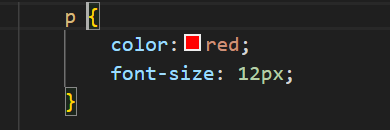
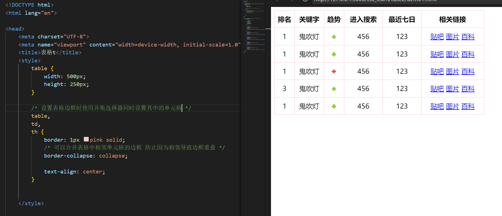
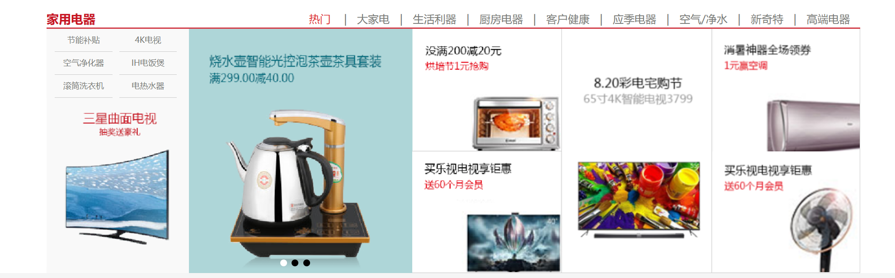
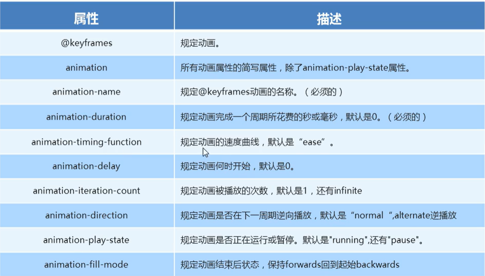

# CSS3

# 结构

一条CSS语句由选择器和一条或多条声明构成，声明用{}括起，选择器和{}之间规范有一个空格 ，数字之后跟单位，属性用分号隔开，参数不需要打引号。

	


# 属性

| 属性                 | 含义               |
| -------------------- | ------------------ |
| font-size            | 字体大小           |
| color                | 颜色               |
| backgroud-color      | 背景颜色           |
| font-family          | 字体               |
| font-weight          | 字体粗细           |
| font-style           | 字体样式           |
| text-align           | 水平对齐方式       |
| text-decoration      | 文本装饰(下划线)   |
| text-indent          | 文本缩进           |
| line-height          | 行间距             |
| border-width         | 边框宽度           |
| border-style         | 边框风格           |
| border-color         | 边框颜色           |
| display              | 显示模式           |
| backgroud-color      | 背景颜色           |
| backgroud-attachment | 背景滚动           |
| backgroud-repeat     | 背景平铺           |
| backgroud-position   | 背景图片位置       |
| backgroud-image      | 背景图片位置       |
| padding-left         | 左内边距           |
| padding-right        | 右内边距           |
| padding-top          | 上内边距           |
| padding-bottom       | 下内边距           |
| margin-left          | 左外边距           |
| margin-top           | 上外边距           |
| margin-bottom        | 下外边距           |
| margin-right         | 右外边距           |
| list-style           | 无序列表的样式     |
| border-radius        | 圆角矩形           |
| box-shadow           | 盒子阴影           |
| text-shadow          | 文字阴影           |
| clear                | 清除浮动           |
| position             | 定位模式           |
| top                  | 顶端偏移量         |
| bottom               | 低端偏移量         |
| left                 | 左侧偏移量         |
| right                | 右侧偏移量         |
| z-index              | 定位权重           |
| cursor               | 鼠标样式           |
| visibility           | 显示隐藏           |
| overflow             | 溢出显示隐藏       |
| outline              | 表单轮廓线         |
| resize               | 防止拖拽文本域     |
| vertical-align       | 图片与文字对齐方式 |
| white-space          | 指定是否换行       |
| box-sizing           | 盒子大小计算方式   |
| transition           | 过渡               |
| transform            | 转换               |
| transofrm-origin     | 设置转化的中心点   |
| animation            | 动画               |
| opacity              | 透明度             |
| perspective          | 透视               |
| transform-style      | 子元素是否3D       |
| border-collapse      | 合并表格边框       |
| resize               | 文本框是否可拉伸   |
|                      |                    |
|                      |                    |
|                      |                    |
|                      |                    |
|                      |                    |
|                      |                    |
|                      |                    |
|                      |                    |
|                      |                    |


# 基础选择器

基础选择器：标签选择器 类选择器 id选择器 通配符选择器

标签选择器：按照html标签选择，但是不能设计差异化设计，只能选择全部的当前标签


类选择器：单独选一个或者某几个标签。通过给标签一个class属性来实现选中指定标签的的标签，注意类名不能以数字打头。

基本格式为   .类名{...} 这个类名不能与标签重名


类名可以有多个，用空格隔开。如果两个类名冲突了在没有其他设置的情况下，会执行最后定义的CSS语句


id选择器，使用方式类似于类选择器也是给定一个新属性，不过这里以#打头，id选择器只能被使用一次，一般用于页面唯一性的元素上。


通配符选择器 * {}会设置所有的标签，可能会与其他的选择器冲突，如果有设置了id选择器那么通配符的效果不会影响到id选择器修饰的标签上，因为后者优先级更高。


链接和标题的字体和颜色要单独指定样式，因为它们相当于浏览器使用类标签制定了字体和颜色的样式，而继承的优先级低于类，因此通过设置外部标签(body一类的)无法改变它们的样式。


# 字体属性


字体样式参数建议使用英文，如果给定中文在一些浏览器中会解释为乱码，如果没有对应的英文可以使用中文字体的Unicode编码

代替。	 


在属性太多的情况下可以写复合语句减少码量


# 文字垂直居中

设置文字的行高等于盒子的高度，行高越小文字离上边界的距离越小。


# 文本选择器


颜色可以使用FastStone Capture 取色器获得

注意图片img标签在修饰时视为文字，想要让图片居中对齐只能给包含图片的标签一个居中属性。

盒子添加text-align:center;会是其中所有的行内元素以及行内块元素水平居中。


# 引入方式

按照CSS样式书写的位置，CSS样式表可以分为三大类：行内式 嵌入式 链接式

嵌入式：写在html内部（一般在head标签内），将所有的CSS代码提取出来，单独放入一个style标签中，此种方式方便控制整个页面的样式。

行内式：如果指向简单修改一个标签那么可以使用行内式，形如<div style="color: red; font-size=12px;"> 注意要是双引号且需要用 ; 分隔。

链接式(外部样式表)：样式单独写到CSS文件中，再把CSS文件引入html页面中，通过<link res="stylesheet" href="css文件名">。


css文件中的样式此时不需要被style包裹，可以直接写。


# Emmet语法

用于快速生成html和CSS语法

VScode中的代码补全就是Emmet的一种

+ 生成多个相同标签加上* div*3可以快速生成3个div标签
+ 兄弟关系标签用+    div+p先生成一个div再生成一个p
+ 父子关系标签用> ul+li    ul>li*3可以组合使用
+ 带类名和id的标签，.index1自动生成<div class="index1">默认下是div标签，如果是p.index1则会生成<p class="index1">，可以组合使用div+p#index
+ 自增类名和id    .index$*5 会生成<div class="index1"><div class="index2"><div class="index3">...
+ 默认文本内容    p{来自理塘的爱}*10 会生成10个<p>来自理塘的爱</p> ，加上$p{来自理塘的爱$}\*10 可以实现自增


在CSS中Emmet用法在于缩写，h200 w100可以直接设置高和宽，tac设置text-align:center ti2em设置text-index:2em;


# 复合选择器

后代选择器：可以选择父元素里面所有的子元素，外层标签和内层标签用空格隔开，可以写多个内部标签，这样会一层一层的往下查找。


如果有多个ol标签可以给其中一个ol标签类名然后在后代选择器里面组合类名使用


子选择器：后代选择器会选择所有的元素，但如果只想要ol下的a标签而要忽视li下的a标签则需使用子选择器，该选择器只会选出直接子元素而不会包含所有的间接子元素。


使用大于号隔开


并集选择器 ：可以选择多组标签，同时定义相同的样式，逗号分隔按照规范要竖着写，可以和后代/子选择器一起使用


伪类选择器：向选择器添加特殊的效果

链接伪类用于链接操作，包括有四种形式，如果使用的话要按照下图的相对顺序，这里也可以使用a标签的类名。


focus伪类用于表单操作，选择光标所在的表单元素


获取被勾选的表单元素


# CSS3新增选择器

属性选择器，使用中括号包裹属性，注意属性选择器是[XX=XXX] ，实际使用的div[X=XX]实际上是**复合选择器**	


结构伪类选择器


伪元素选择器

**通过CSS创建一个元素**，但是属于**行内块元素**，新创建的元素在文档树中是找不到的，因此称为伪元素，使用双冒号标识。用于减少html标签的使用简化结构 。


 伪元素经常与字体图标搭配使用 在盒子中用CSS添加伪元素然后利用**定位**移动到指定的位置，这里的content可以设置为字体图标面的编码，注意带上\


当鼠标经过时选中伪元素


伪元素选择器也可以清除浮动


# 元素显示模式

元素显示模式指的是元素(标签)以什么方式进行显示，比如div独占一行，一行可以放多个span。

html元素一般分为块元素和行内元素以及一种特殊的行内块元素


\<h1>~\<h6>,\<p> ,\<div>,\<ol>,\<ul> ,\<li>属于常见的块元素，块元素独占一行，高宽边距可以自定义，内部可以放其他的块和行内元素，**如果没有指定宽度则默认为父容器的宽度**，高度并不会继承。注意文字类的元素内不能使用块级元素比如p h1，块元素会被内部的内容撑开，但是注意如果其中的内容是浮动的那么就不会撑开盒子。


a strong em b del inv span等属于行内元素，相邻的行内元素显示在一行中，行内元素无法直接设置宽和高，默认的宽度是本身内容的宽度，只能容纳文本和其他行内元素以及行内块元素(例外：链接中不能写链接，链接中可以放块元素)。


img input td同时具有块元素和行内元素的特点，相邻的行内块元素显示在同一行上，但是它们之间会有空白间隙，默认的宽度/高度是本身内容的宽度/高度（也就是不会继承父元素），宽高以及边距可以设置。

借助行内块元素的特性可以快速实现：


特殊情况下需要元素模式的转换，也就是一个模式的元素需要另一种模式的特性，比如增加链接的触发范围，这里的转换会舍弃原本的特性。

设置display:bolck可以变为块元素的特性，display:inline 反之，display:inline-block行内块元素


# 坐标


# 背景

小的装饰性图片一般使用背景插入，块的大小可以通过查看图片的大小来设置。


背景的属性也像文本一样可以连写。


**background-size: contain;缩放背景图片以完全装入背景区**


背景颜色可以设置为半透明状态

backgroud:rgba(0,0,0,0.3)；


# CSS三大特性

层叠性：使用了相同的选择器，选择器中对相同的属性进行了设置但是设置的参数不同，会按照就近原则（即执行距离标签近的），只会覆盖冲突的属性。


继承性：子标签会继承父标签的某些样式，比如文本颜色和字号行高，通过设置body标签可以直接影响到body中div的颜色和文本大小。在设置CSS样式时也会div也会继承body的一些属性。


优先级：!important>行内>ID>类|伪类>标签>通配符|继承，注意继承的权重很低(即使给父元素加上!important)


属性选择选择器权重为0010，注意属性选择器是[XX=XXX] ，实际使用的div[X=XX]实际上是**复合选择器**，伪元素选择器的权重是**0001**

复合选择器的权重是**叠加的（注意不会进位）**，注意权重是属性冲突时计算的，如果存在其他的不冲突属性则依然会生效。


# 盒子模型

一个封装html元素的盒子，由外边距，内边距，边框，内容组成。


# 盒子边框

边框会改变盒子的大小(+2*border-width)


 

很多时候实现hover触发外部的盒子边框时会出现内部的内容被挤开，这里可以先给盒子一个边框但设置为**透明色**，触发hover时改变颜色。

或者使用padding也是一个选择





img的图片会与边框有**间隙**，解决方案详见**垂直居中**。


# 盒子内边距

文字默认在盒子的右上角

内边距会影响盒子的实际大小，宽+=左右内边距     高+=上下内边距

边距可以用来撑开盒子，实现类似文字对齐的效果(要求没有预先设置宽度值)，这里如果预先指定了小盒子的宽度然后设置文字居中，那么会导致小盒子之间的距离不均匀(因为文字量不同)


# 盒子外边距

控制盒子与盒子之间的距离，可以实现盒子居中。

外边距的使用方式与内边距相同


如果盒子没有定义高/宽，则给定内部盒子外边距会撑开外部盒子，否则内部的盒子会移开。


定义外边距的过程中可能会出现外边距的合并，对两个嵌套关系的父子元素，父元素有上边距同时子元素也有上边距，此时父元素会塌陷较大的外边距值，简言之就是子元素的上边距没有效果。**浮动的盒子不会出现塌陷。**


通过以下三种方式解决


当多个盒子浮动排列在一起且每个盒子都有一个边框，此时相邻的元素的边框会凑到一起导致边框显得很粗


可以通过给盒子设置margin负值让边框重叠，即使第一个盒子**也会向左移动**，但因为**浮动**的效果使得第二个盒子会**先紧贴第一个盒子然后再移动**。


如果想实现鼠标经过盒子盒子的边框会变化，会出现如下的情况


这是因为设置负边距导致后面的盒子**压住了**前面的盒子，且后定义的盒子**优先级更高**，此时，如果选中的盒子**没有定位**则添加一个**相对定位**，否则**设置z-index**。


# 清除边距

网页中的元素会带有默认的内外边距，首先清除掉所有默认的边距才能更好的布局。	


# 边距总结

上下用margin 左右用padding，盒子与盒子用margin 内容与盒子用padding


# CSS3盒子模型box-sizing

该属性用于改变计算盒子大小的方式

box-sizing:content-box;默认下盒子大小为盒子宽高+padding+boder-width

box-sizing:boder-box;则盒子大小就是盒子的宽高，也就是不会被撑开


注意并非设置了box-sizing就万全了，给盒子加边框会将里面的内容挤开。


# 清除列表圆点


# 圆角盒子


# 盒子阴影


盒子阴影不占用空间


# 文字阴影


# 图片模糊


# 传统网页布局

标准流 浮动 定位

网页元素竖向排列用标准流 横向排列找浮动


# 标准流

标准流——块级元素独占一行，从上往下顺序排列，行内元素按照顺序从左往右排列，遇到父元素边缘会自动换行。


# 浮动

使用标准流存在很多的布局效果无法完成，浮动可以改变元素标签默认的排列方式——多个块同一行显示


浮动属性用于创建浮动框，将其移动到一边，直到遇到另一个块或浮动框。

浮动的盒子会**顶端对齐并贴排列在一行**（保持相对顺序），如果宽度不够则会另起一行。


浮动的元素会脱离标准流移动到指定位置，其原先的位置会被**之后**标准流中的元素补上，因此浮动的元素是不会影响/超过其前面的标准流元素的。标准流元素可能会与浮动元素位置重叠，此时浮动元素**会压住标准流元素的盒子，但是不会压住其中的内容/图片（因为浮动最初是用于左文字环绕的）。**


浮动的元素会具有**行内块元素**的特性。


为了约束浮动元素的位置，网页布局一般采取：先使用标准流的父元素排列上下位置，之后内部子元素采取浮动排列左右位置，**并且一浮全浮**。


可以通过扩大ul大小让浮动的li排到一行


# 清除浮动

并不是所有的父元素都能给定一个高度（对于不同的内部内容所需的高度不同），理想的情况是让子盒子撑开父亲 ，但是浮动的元素是不占有位置的因此无法撑开盒子。

下图中没有如愿撑开盒子，而且因为盒子没有高度导致后面的盒子贴了上来。


本质是清除浮动造成的影响，如果父盒子有高度则不需要清除浮动。

+ 添加额外标签

在最后一个浮动元素后面加一个块元素并令设置clear属性


+ 添加overflow属性


+ 添加after伪元素

是额外标签法的进阶，给父元素一个新的选择器，效果相当于在父元素的后面添加一个新盒子。


+ 添加双伪元素，在两边生成盒子


# 图片格式

jpg：对色彩的信息保留较好，高清，颜色较多，产品类图片经常用到jpg格式

gif用于小动画效果

png可以实现透明背景

还有一种专门的psd文件，是UI创建出给前端人员的，可以使用相关的软件获得其中的尺寸，文本等信息。

 


# CSS属性顺序


# 页面布局总体思路

+ 确定页面的可视区
+ 分析页面的行模块，以及行模块中的列模块
+ 确定列的大小，之后确定列的位置


# CSS定位

可以实现某个盒子随意的移动位置并可以压住其他的盒子，定位=定位模式+位偏移（可以设置为**负数**）

定位模式分为五种：静态定位(无定位)


相对定位：**相对于原来位置移动，不脱标**


绝对定位：**相对于祖先元素（最近的带有定位的祖先元素）移动**，如果没有父元素或者父元素没有定位则以**浏览器**为准，该模式会脱标不占有原来位置，即托标，这里通过设置参数可以到达盒子内的任意位置，并且**不会被前面的块级元素挡住**。

这里参数中的百分比是以父元素为准的。


如果父元素是有定位的则以父元素为准


绝对定位和相对定位会使元素具有类似浮动的性质，但是**会完全压住 盒子（文字/图片）**。

一般实现中遵循子绝父相：子级使用绝对定位，父级使用相对定位。


固定定位：使得页面滚动时页面元素的位置不会改变，**以浏览器的可视窗口作为参照点，脱标不占有位置**。

想要实现距离贴近版心的固定定位，需要设置left:50%;margin-left:版心宽度的一半;

加了**固定定位和绝对定位**的盒子无法通过**margin:0 atuo;实现页面居中**，可以设置**left:50%;margin-left:宽度的一半的负数**;实现水平居中，垂直居中同理。


粘性定位：以浏览器的可视窗口为参照点，保留原先的位置，必须**添加位偏移**（否则效果类似绝对定位），使用较少。


定位之间也可能出现重叠的情况，因此会有一个属性(z-index 可以是负数 默认为auto 不需要加单位)用来规定定位次序，数值越大优先级越高，如果值相同则后定义的优先级更高。


#  元素的显示与隐藏

比如页面中关闭广告，但是重新刷新网站后又会重新出现，或者移动到页面上时会出现特殊效果。

+ display:none;隐藏元素，并且**不在占有原先位置**，display:block;转换为块级元素并显示元素。
+ visibility:hidden;隐藏元素，**保留位置**，visibility:visable;元素可视。
+ overflow:hidden; 如果内容溢出了元素的框，overflow:scroll;会给盒子多出一个滚动条，overflow:auto;需要时添加滚动条。


注意对于**定位**的盒子需要慎用溢出隐藏


鼠标经过时显示其中的隐藏层的实现要先选择外面的盒子(.box:hover)然后用后代选择器选中里面的隐藏层设置属性——.box:hover .shadow


# 精灵图

一个网站中往往会应用多个背景图片，当背景图片过多时服务器会**频繁的接受和发送请求图片**，造成服务器压力过大从而**降低页面加载速度**，CSS精灵技术可以有效地**减少服务器接收和发送请求的次数**，提高页面的加载速度。对于插入的图片由于要**经常更换所以不需要做精灵技术**。

核心原理：将网页中**小的背景图片整合到一张大图**中，这样就只需要**一次请求**了。


通过设置**backgroud-position**来对准需要的图片，如果**想往左移动则设置-x值，想往上移动则设置-y值**。

 


可以通过**fireworks软件**测算出具体位置


# 字体图标

网页上通用的常见的小图标，展示的是图标但本质是字体。

+ 轻量级:一个图标字体要比一系列的图像要**小**。一旦字体加载了，图标就会马上渲染出来，**减少了服务器请求**。
+ 灵活性:**本质其实是文字**，可以很随意的改变颜色、产生阴影、透明效果、旋转等
+ 兼容性:几乎支持所有的浏览器。

注意:字体图标不能替代精灵技术，只是对工作中图标部分技术的提升和优化。


对于结构样式比较简单的小图标就用字体图标。

字体图表从https://icomoon.io/app/#/select下载压缩包，解压后将其中的fonts文件复制到代码的根目录下，复制下述内容


在html的style中粘贴，


demo.html中可以复制字体样式


要设置font-family


如果想追加新的字体则需要去官网导入文件夹中的select.json，然后添加想要的图标，最后重复之前的步骤即可。


# 三角


发现当把盒子的**宽和高设置为0**，此时给盒子设置一个边框会出现右侧所示的效果，说明边框实际上用三角形实现的，因此可以通过边框来添加三角形。通过将其他三个位置的颜色设置为**透明色**可以得到单个三角形，**设置边框的宽度可以调节三角形的大小，这个宽度实际上就是小三角的高。**


想要实现大方块附带一个小三角，需要使用定位，即想给定一个大盒子然后在大盒子中给一个小盒子，将小盒子设置为三角的形状然后用绝对定位放到指定的位置，注意需要位偏移**指定2倍左右的边框宽度**才能让三角翻上去。


 三角形可以调整参数得到梯形


初始有将**下边框的宽度改为0**得到将**左边框改为0**有最后**调大上边框**并设置颜色为**透明**即可得到直角三角形


 


# 鼠标样式


+ default默认样式
+ pointer小手
+ move移动（移动图片时的十字键头）
+ text文字光标
+ not-allowed禁止


# 取消表单轮廓和防止拖拽

在点击表单的时候，表单会出现加粗的轮廓线可以动过**outline:0/none;**取消轮廓线.

在使用文本域时，文本域的右下角可以拖拽用于拉大文本域，实际开发中不会允许随机拉大文本域，因此使用**resize:none;**防止拖拽文本域。


# 居中垂直

vertical-align只针对**行内元素或行内块元素**有效


一般用于**垂直对齐一行内的图片**


或者**对齐表单元素**


也可以解决图片底线的问题 ，由于图片是按照基线对齐的因此当给盒子一个边框时会与下边框留有一定距离，这里只要让图片**不是基线对齐**即可解决问题，或者**转换为块级元素**这样就不会因为对齐造成问题。


# 溢出文字省略号显示

单行溢出


多行省略号，兼容较较差，了解即可。

```html
/* 隐藏溢出元素 */
overflow: hidden;
/* 用省略号代替超出部分 */
text-overflow: ellipsis;

display: -webkit-box;
/* 在第几行出现省略号 */
-webkit-line-clamp: 2;
-webkit-box-orient:vertical;
```


# CSS3过渡

直接使用hover触发效果的表现很差，这里添加过渡属性使变化**渐渐过渡**，**谁做变化给谁过渡**。

 


# favicon图标

标题中的图标


该图标的后缀名为ico，需要用从https://www.aconvert.com/cn/icon/png-to-ico/将png格式转换

需要将图标放到根目录下，随后在head标签内写入<link rel="shortcut icon" href="favicon.ico">


# SEO

SEO 的目的是对网站进行深度的优化，从而帮助网站获取免费的流量，进而在搜索引擎上提升网站的排名，提
高网站的知名度。

SEO优化有相关人员负责。

页面中必须有三个标签(TDK)来符合SEO优化


Logo SEO优化

**logo中放一个h1标题 提权，在当一个可以返回首页的链接，logo的图片用背景图片展示，链接中还要放文字(可以是网站的名称)但是不要显示出来(大小设置为0)，最后给链接一个title属性**


# 开发中常用的类名


形如，叫tab-list


# 排版


需要遵循上图中的排版




# 转换

transform可以实现元素的位移，偏移，缩放等功能。


最大的优点是**不会影响其他盒子的位置**，**对行内元素无效。**  注意坐标点是以**自身**为基准的。


可以和**定位**实现盒子**居中垂直**


可以利用旋转实现**小三角**，即只给两个边框然后设置旋转。


元素旋转的中心点可以通过**transofrm-origin**设置 默认是元素的中心位置


scale可以实现缩放，**并且不会影响其他盒子**，缩放的中心点也是用**transofrm-origin**设置的。


可以组合**多个**效果使用**空格**隔开，但是注意**不同的顺序会导致不同的结果**，一般将位移放到最前面。


# 动画

动画可通过**设置多个节点**精准控制一个或一组动画，常用来实现**复杂**的动画效果，相比于过渡，动画可以实现**更多样化，更多控制，连续自动播放**的效果。


首先需要**定义**动画然后才能使用动画，一个元素可以添加多个动画使用**逗号分割**


动画包含许多属性





简写方式 前两个是必须的


速度曲线中有一个**steps()**步长设置，表示动画**分几步**完成动画

可以借助这个属性完成打字机效果


这个属性可以实现gif效果，通过改变背景图片的位置用步长定格。


实现波纹效果


首先给定一个盒子定位到**指定位置**，然后在其中定义三个小盒子使用**定位**进行垂直居中，之后**定义**动画，波纹的效果是通过设置盒子**阴影**实现的，而波纹放大则是通过扩大盒子的**宽和高实现**的，这里如果使用scale会一并**放大阴影**，最后分别设置三个盒子动画的**开始时间**。


实现鼠标经过内容就会抬起：当鼠标经过时给盒子**添加阴影(box-shadow: 0 3px 8px rgba(0, 0, 0, 0.2);)**并移动位置(**top:-3px**)，可以设置盒子为**相对定位**


 


# 3D转换	

想要在2D平面产生3D效果需要使用**透视**，模拟人的视觉位置，透视也成为**视距：就是人眼到屏幕的距离**，**距离越近成像越大**。透视写在**被观察元素的父元素(不要求直接父元素)上**，**数值越小效果越明显**。


transform:translateXZ(100px)会让元素在Z轴上移动，**正值**会向屏幕**外**移动，**负值**会向屏幕**内**移动，加上透视后的表现就是元素变大变小。


transform-style: preserve-3d;可以让子元素保持3D效果，否则在父元素实现3D效果时子元素会退出3D状态


实现左右反转的盒子


实现上下反转的盒子，首先让盒子叠在一起，然后将一个盒子沿X轴旋转


让这个盒子到底下去


将上面的盒子前移，如果后移下面的盒子，在旋转大盒子的时候会不协调因为大盒子以下图红色横线位置为中心点旋转


实现旋转木马的效果需要先绕Y旋转然后再向外移动	


# flex布局

弹性布局，操作方便布局极为简单，**任何元素**都可以指定该布局，父元素设置后内部的子元素的**flaot vertical-align和clear**会失效，子元素可以**横向排列也可以竖向排列**，子元素会具有类似于**inline-block**的特性，注意设置了flex的盒子可以被**子盒子撑开**，同时子盒子如果没有高度则会**继承父元素的高度**，随父元素的增大而增大。


设置为flex的父元素包含有以下元素：


flex中分为主轴和侧轴，默认下分别为x和y，**元素跟着主轴排列**，设置主轴后**剩下**的就是侧轴


justify-content 设置元素在主轴上的排列方式


弹性布局中元素会显示在一行，如果子元素的宽度之和大于父元素则会自动修改子元素的宽度


align-items设置元素在侧轴上的布局方式，只适用于**单行**下


align-content 适用于**多行**情况下侧轴上的布局方式，**单行下没有效果**


flex-flow


子元素的属性


flex 表示占有剩余空间的几份，实现百分比的效果


align-self控制子项在父元素的**侧轴**上的排列方式，可以覆盖父元素设置的排列方式


order可以**定义项目的排列顺序**，数值越**小**越靠前，默认是**0**


实现类似柱状图的效果

每个柱子用align-items: flex-end;设置到底部，数值和日期放在柱子中以y轴位主轴通过justify-content: space-between;拍不到柱子两边再用外边距移动到外部。


# less

Less （Leaner Style Sheets 的缩写） 是一门向后兼容的 CSS 扩展语言。这里呈现的是 Less 的官方文档（中文版），包含了 Less 语言以及利用 JavaScript 开发的用于将 Less 样式转换成 CSS 样式的 Less.js 工具，简言之是在**CSS之上提供了一些新的功能**。

详见官网https://less.bootcss.com/


