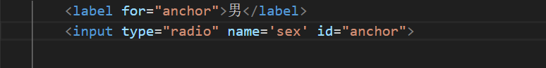

# HTML5

# HTML概述

HTML是一种超文本(除了文本外还可以放入图片视频，可以从一个文件跳转到另一个文件)标记语言，是用来描述网页的一种语言，不是编程语言而是标记语言。


# Web标准

因为浏览器的不同，它们显示的页面存在差异，因此需要代码符合一个标准来形成规范。


Web标准由三部分组成：结构HTML，表现(网页元素的版式颜色大小)CSS，行为(交互)JS，最佳体验方案是三者分离


# 开发工具

使用VScode，按下!+tab补全即可得到基本的骨架

安装open in browser 即可右键选择 open in chrome执行。

安装auto rename tag 可以双击双标签选中，然后同时修改

安装liver preview 右键后预览可以实时看到网页变化

安装easy-less 可以将less文件保存为css文件


# HTML标签

标签必须包括在<>中，大部分标签都是成对出现(双标签)的-结束标签的前面会以/打头：<html>  </html>

双标签关系可以分为两类：包含关系和并列关系


·

此外还有少数单标签不需要结束标签<br />


| <html></html>   | HTML标签   | 根标签                       |
| --------------- | ---------- | ---------------------------- |
| <head></head>   | 文档的头部 | 必须在head中设置             |
| <title></title> | 文档的标题 | 页面的标题                   |
| <body></body>   | 文档的主题 | 页面的内容基本是放在body中的 |


```html
<!DOCTYPE>文档类型声明，告诉浏览器使用的是那个版本的html来显示网页，必须写在开头

lang 定义当前文档显示的语言 en英语，zh-CN中文 一些默认的弹窗(翻译)取决于这个设置，文档中的内容可中文可英文

charset 字符编码 UTF-8基本包含了所有国家的字符
```

简单测试一下

```html
<!DOCTYPE html>

<html lang="zh-CN"> 
<head>
    <meta charset="UTF-8">
    <title>第一个网页</title>
</head>
<body>测试一下</body>
</html>
```


## 基本标签

+ 标题标签<h1>~<h6>表示一级二级三级...一个标题会独占一行
+ 段落标签<p>paragraph 将文字分为不同的段落，不同段落之间会间隔一行
+ 换行标签\<br /> 浏览器不会显示文本回车的换行，只有通过\<br />标签才能实现强制换行


+ \<div></div>没有语义，是一个装内容的盒子，一行只能放一个，会占用一整行接在后面的内容会显示到下一行中
+ \<span></span>也是一个盒子，但是一行可以放多个，接在后面的内容会显示在同一行


## 文本格式化标签

+ 加粗 <strong></strong>或者<b></b>
+ 倾斜<em></em>或者<i></i>
+ 删除线<del></del>或者<s></s>
+ 下划线<ins></ins>或者<u> </u>


## 图像标签

特殊的单标签

+ src 路径
+ alt 替换文本 当图像显示不出来的时候，显示的文字 
+ title 提示文本，鼠标放到图像上显示的文本
+ width 宽 
+ height 高 
+ border 图像边框的粗细

宽和高的数值用字符串设置，修改其中之一另一个参数会等比例缩放。

参数之间没有顺序要求，但必须用空格隔开


路径分为相对路径和绝对路径

相对路径的访问下一级：nxfloder/img.jpg，访问上一级：../img.jpg 

绝对路径移植性较差一般用的较少，绝对路径使用\。


## 超链接标签

从一个页面连接到另一个页面

基本链接分为外部链接和内部链接，前者是访问到相对与本网站之外的网址，后者是跳转到同一个网站内部的网址

```python
<a href="跳转目标的url 外部链接必须以http://打头 传入#表示空链接" target="窗口的弹出方式 默认在当前窗口的打开，填入_blank在新窗口打开"> 修饰用的文本和图像</a>
<a href="javascript:alert('Hello, World!')">Click me</a> 点击会执行js代码

```


内部链接可以跳转同一个目录下的html文件，这里不需要指定http://


下载链接，href中放入的是zip exe文件要是在同一目录下的。


锚点链接，效果类似于大纲可以跳到页面的某个位置


返回的标签可以添加到body中这样可以快速定位


实际实现中多个标签使用li+a的方式完成。


# 注释


ctrl+/可以快速注释和取消注释	


# 特殊字符

编辑文本的过程中文本中，多个空格只会显示为一个，只有通过关键字\&nbsp;才能实现


此外还有，主要使用空格大于小于


# 表格

表格可以规整的展示数据，用于布局


可以在table中设置参数改变表格样式，width height设置宽和高，border设置边界大小，cellspacing设置单元格之间的距离，还有cellpadding规定文字与边框之间的距离。


由于表格的实现可能会很长

因此出现了\<thead><tr>  <th></th>   <th></th>   <th></th>    </tr>.... <\thead>标签划分表头区域

以及\<tbody> <tr>  <td></td>    <td></td>    <td></td>    </tr>....   <\tbody>划分表格的主体部分


合并单元格，设置td中相应的参数：rowspan="合并单元格个数"跨行合并(在最上侧写合并代码)，colspan="合并单元格个数"跨列合并(最左侧写合并单元格)

找到目标单元格（即写代码的位置）写入合并方式后，注意删除多余的单元格（删除td标签），合并单元格相当于是构建了一个大的单元格，原先的单元格不会被删掉而是会被挤到一边，因此需要删除。


# 列表标签

列表用于布局

根据使用场景的不同分为三大类：无序列表，有序列表和自定义列表。


无序列表格式如下，ul标签中只能放li标签，li中可以放任意元素，不要把ul当作一个盒子，只有其中的li才是盒子。


 

有序列表格式如下，约束同无序列表


自定义列表


dl包裹所有，dt包裹要解释的名词，dd包裹解释内容，注意dt不包裹dd


# 表单

用于让用户交互，收集资料


表单：表单域，表单控件(表单元素)，提示信息


表单域

action定义收集到的数据送到那里去处理，method定义提交的方式，name指定表单的名字用于与其他表单区分 autocomplete是否记录填写内容

```python
<form action="" method="" name="" autocomplete="off" >

</form>
```


表单元素

input输入表单元素，使用单标签<input>


required表示不能为空


<label>标签用于绑定一个表单元素，当点击<label>标签内的文字时，可以自动将光标转到对应的表单元素上

指定两个属性的名称相同




select下拉表单元素

注意select属于表单元素是应该放在form中的，option中定义


textarea文本域元素

输入文字内容较多时input标签的单文本框就不够用了


H5中新增了表单的类型

下述的表单类型需要搭配表单域只有在点击提交的时候才会验证内容的正确


新增的表单属性


# 语义标签

为了防止一直重复使用div标签导致的难以区分语义。

实际效果和用法与div一致


# 视频

视频标签video只支持MP4 WebM Ogg三种格式，其中MP4几乎支持所有的格式。


# 音频

audio支持MP3 Wav Ogg三种格式，其中MP3最通用。

使用方式和video相同


​	
