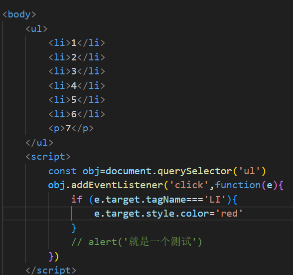

# JS进阶

JS是一种运行在客户端的编程语言，实现人机交互的效果，可以实现网络特效，验证表单的合法性，服务端编程，数据交互。


# JS基础

## 位置

JS需要用script包裹，写在**body**标签的**最下面**，因为JS是解释型语言必须先有html内容才能使用。


JS也可以写到外部


外部的写法


## 注释和结束符


结束符使用**;**，但是可以**省略**，**一般不写**。


## 输入输出


输出


console.dir()可以详细的输出对象


输入


alert和prompt会跳过页面渲染**先被执行**


## 检验数据类型


## 变量

注意JS里中文是可以当作变量名的，因此用中文作为值得时候需要加**引号**，JS中字符串使用单引号和双引号都一样。

```javascript
// 使用关键字let声明 不能重复声明 变量名提倡使用小驼峰 除第一个单词外其他单词的首字母都大写
let age=18, name=prompt('输入你的名字')

// 使用const定义常量 声明的同时必须初始化 不能重新赋值
const X=10

// 特殊值NaN未定义的值 与任何数值运算的结果都是NaN	
console.log(NaN+2)

// +可以拼接字符串
document.write('1'+'2')
document.write('1' + age)

let x=0.1902
Number.toFixed(2) // 指定保留小数的位数四舍五入 默认为0

// 格式化字符串使用反引号包裹在其中用${}包裹所需内容
document.write(`我是一个${age}岁的孩子`)

Number.isInteger(x) //判断参数是否是整数，返回布尔值
```


`undefined` 是 JavaScript 中的一种原始**数据类型**，用于表示一个变量未被赋值或未定义的状态——**未初始化的变量；函数没有显式返回值；尝试访问一个对象中不存在的属性**；

`null` 是一个**对象**，表示“无值”。

Boolean()可以转换为布尔值

小数计算有精度误差，可以先转换为整数计算


## 字符串

字符串可以使用**索引查找**但是**不能修改**，不能使用**索引切片**

```javascript
console.log(str[1]);
```


函数charAt()也能提取指定索引出的字符

```javascript
console.log(str.charAt(1)); 
```


trim去除字符串两端的空格

```javascript
console.log(str.trim()); 
```


split(separator)分割字符串

```javascript
console.log(str.split(",")); 
```


切片

```python
console.log(str.substring(1, 4));
```


返回子字符串首次/最后一次出现的位置，如果未找到则返回 -1

```javascript
console.log(str.indexOf("e")); 
console.log(str.lastIndexOf("l")); 
```


返回大小写

```javascript
console.log(str.toUpperCase());
console.log(str.toLowerCase());
```


替换字符串	

```javascript
new_str=str.replace(正则表达式,替换的文本)
```


检测是否以某个字符串开头 可以指定开始从那个位置开始搜索

```javascript
str.startsWith("world", 7)
```


检测字符串是否包含另一个字符串 可以指定开始位置

```python
const str = "Hello, world!";
console.log(str.includes("world"，5)); 
```


## 进制数

```python
0o10101 // 八进制使用0o打头
ox10101 // 十六进制使用0x
ob111 //二进制0b打头
```


## 数组

```javascript
// 序号从0开始 JS中的数组形似python中的列表 可以储存各种数据类型	
let arr=[1,2,3,4,5]

// 通过属性length获得长度
console.log(arr.length)

arr.push(4); // 末尾添加 4 可以添加多个数据用逗号分隔
arr.unshift(0); // 开头添加
arr.pop();// 弹出尾部
arr.shift();// 删除第一个元素
arr.splice(4,1)// 删除从index开始的n个元素
arr.splice(0,1,'xxxx') // 效果等同于替换第一个

let index = arr.indexOf(3);// 查找元素索引 如果不存在则返回-1
let exists = arr.includes(10);// 查找是否存在

// JS中数组的排序是默认按照字典序的 对数字数组需要定义比较函数
arr.sort((a,b)=> a-b)
const arr = [
    { name: 'item1', price: 100 },
    { name: 'item2', price: 200 },
    { name: 'item3', price: 150 }
];
// 按照价格从低到高排序
arr.sort((a, b) => a.price - b.price);

// 翻转数组
arr.reverse()

// find函数用于找到数组中第一个满足条件的元素 如果不存在返回undefined
const person = people.find(person => person.age > 30);

// 切片和拼接
let arr = [1, 2, 3, 4, 5];
let slicedArr = arr.slice(1, 4); // [2, 3, 4]
let newArr = slicedArr.concat([6, 7]); // 一般使用展开运算符 


// every相当于python中的all 返回布尔值 some同any 用法相同
const allPositive = numbers.every(num => num > 0);

// map遍历数组处理数据 返回新数组
const arr=[]
const newarr=arr.map(function(ele,index){
    return ele+'xxx'
})

// 注意如果直接使用数组 当前面存在代码时 必须用;开头 否则会自动将[1,2,3]连接到前面代码上
;[1,2,3].map(...) 

// join组合数组为字符串 默认为逗号分隔
arr.join('')

```

```python
修改器方法：
push()
pop()
shift()
unshift()
splice()
sort()
reverse()

访问器方法：
concat()
join()
slice()
forEach()
filter()
map()
every()
some()
reduce()
reduceRight()
indexOf()
lastIndexOf()
find()				返回第一个满足条件的元素，参数是回调函数
findIndex()			返回第一个满足条件的元素的索引，参数是回调函数
```


## Array转换方法


```
Array.of()			创建新的数组，参数作为数组中的元素
Array.from()		将可遍历对象或伪数组转为纯数组
```


JS中存在一些伪数组即具有数组特性，但并不是真正数组的对象，比如 **document.querySelectorAll()**返回的结果和arguments，伪数组无法使用数组的**方法**，可以将其转换为**真数组对象**然后使用相应的方法

```javascript
const argsArray = Array.from(arguments);
```


## 扩展运算符

 **...arr**等价于python中的**解包**

```javascript
Math.max(...arr)//取最值
const new_arr=[...arr1,...arr2]//合并数组
const new_arr=[...arr].sort((a,b)=> a-b) // sorted()的效果
```


除了可以展开数组之外还能将可遍历对象转换为逗号分隔的参数序列

```python
const arr05 = [...'Hello World'];
```


## 数据转换

**+号两边存在值且其中一个是字符串，则会实现字符串拼接效果**，如果只有**一个字符串**则会变为**整型**。

**除了+以外的其他算术运算符会把字符串转换为数值类型**

​	


```javascript
let str = '128.10'
document.write(Number(str)) // 转换为数值类型
document.write(parseInt('12px')) // 只保留整数 字符和小数会被略掉不会四舍五入 只能识别以数字为开头
document.write(parseFloat('abc12px')) // 同时保留小数 可以识别数字在中间的情况
```


## 自增

前自增：++i 先加再返回值

后自增：i++先返回值再自增


## 比较运算符

=== **判断左右两边是否值和类型都相同 ** 

!== **判断左右两边是否不全等**

直接使用**2=='2'的结果是true**，因为'2'会发生隐式类型转换，一般开发中使用=\==

涉及到NaN的判断结果一律是false


## 逻辑运算符


注意&&的优先级更**高**


## 分支控制语句

**if {} else if {} else {}**

**switch(){ case x:break case x:break default:..  }**


## 三元运算符


**条件？满足条件执行：不满足条件执行**


## 二元运算符

如果第一个结果不为null或undefined则取第一个，反之取第二个，有**短路**的特性

```js
0 ?? 100;   // 0
false ?? 100; // false
null ?? 100; // 100
undefined ?? 100;  // 100
```


##  流程控制


​	


可以使用break和continue关键字


## 函数

匿名函数


参数默认值

```python
function 函数名(参数1，参数2=默认值) {
    
}
```


立即执行函数，先写**两个小括号**，前面的括号包裹函数，后面的函数包裹参数表示调用，注意必须加**;**	


动态参数——**arguments是函数内置的伪数组变量，它包含了调用函数时传入的所有实参** 使用argument时函数可以不定义参数

剩余参数(rest)——**function get(X1,X2,...参数名)** 可以将一个**不定数量的参数表示为一个数组** 该数组是一个真数组 剩余参数要写到**最末** 前置**...** 使用时**忽略前缀**

```python
function fn02(name, age, ...data) {
    console.log(name);
    console.log(age);
    console.log('rest参数：', data);  // ['司马姥姥', '欧阳姥姥', '爱新觉罗姥姥']
}
```


## 箭头函数

为了更简短的定义函数 用来代替函数表达式


```javascript
const fn=function(){}

const fn=() => {} // ()中放参数
const fn=x => {} // 只有一个形参时可以省略()
const fn=x => console.log(x) //只有一行代码时可以省略{} 并自动返回不用return 
const fn=(uname)=>({name:uname})// 返回一个对象 因为对象也是使用{}包裹 为了区分代码块和对象 会使用()包裹

form.addEventListener('submit',ex=>ex.preventDefault()) // 阻止表单的默认提交
```


箭头函数中没有**动态参数** 但有**剩余参数**


箭头函数中的this沿用**外层的this**

箭头函数的**this指向window** 因为对于obj他是通过window调用的 所以obj的this是指向window的


箭头函数的**this指向obj** 因为sayHi是由obj调用的 sayHi的this指向obj


## set

```js
const s2 = new Set([100,200,200,200,300,400,400,500, {name:'xiaole'},{name:'xiaole'}]);
size
add()
delete()
has()
clear()
keys()
values()
entries()
forEach()
```


## 对象

对象的定义可以使用字面量类似**字典**，属性之间使用**逗号**隔开 注意属性可以用**变量赋值**，但是变量**修改后**对象的值是**不会变**的


**obj.new_atrtribute=xxx 添加属性**

**delete obj.attribute   删除属性**


使用 **for ... in** 循环来遍历对象所有的可枚举属性 

```javascript
for (let k in user){
   	console.log(user.k)
}
```


**Object.keys(obj)**可以以**数组**形式获得对象的所有**键**  

**Object.values(obj)**获得对象所有的值

**Object.assign(new_obj,obj)** 深拷贝对象 第一个参数是接收者 注意这里实际上是**合并而不是覆盖** 

**Object(obj).foreach(item=>{})**遍历对象，这里需要注意不能使用**Obj.item** ，因为item是字符串


可以使用构造函数创建对象 约定上函数名**首字母大写**    使用**new**调用  内部的属性用**this**定义 

构造函数执行过程：**new 首先可以创建一个空对象，构造函数中的this会指向这个对象，然后执行构造函数的代码最后返回新对象**

```javascript
function Pig(name,age){
    this.name=name
    this.age=age
}
new Pig('xx',10)
```

JS中的构造函数会浪费内存 因为同样的方法会重复许多份


## FormData对象

一个内置对象，用于以键值对的形式构建数据

```javascript
const fd = new FormData();
fd.append('username', 'JohnDoe'); // 添加用户名
fd.append('age', '25'); // 添加年龄
```


## 数学对象


 

想要在数组中随机取数可以直接乘上**数组的长度**


# Web ApI

用于操作网页元素


## 使用常量

**一般规定变量先令为const，如果需要改变则修改为let**，注意**数组和对象**是可以令为const的，毕竟存储的是内存。


##  DOM树和DOM对象

DOM文档对象，浏览器提供的专门用来**操作网页内容**的功能

DOM树，将html文档以**树状结构**直观的表现出来 


DOM对象，浏览器根据**html标签生成的JS对象**，任何一个标签都是一个对象，**所有的标签属性都可以在对象上找到**，修改对象属性会自动**映射**到标签上。最大的对象是**document**，包含网页中**所有内容**。


## 获取DOM对象

通过**CSS选择器**获取DOM对象

```javascript
// 选择匹配的第一个元素 参数是CSS选择器 注意必须使用引号包裹 如果没有找到则返回null
const box=document.querySelector('.box')
// 选择所有匹配元素 返回一个伪数组 无法修改
const box=document.querySelectorAll('.box')
```


也可以通过document对象取得其中的body对象——document.body


## 操作元素内容

**innerText和innerHTML**属性


注意不是方法

innerText只显示为纯文本，**不会解析文本中的标签**。

innerHTML会**识别标签**


## 操作元素属性


常见属性，标签自带的属性如herf


样式属性 注意**值**需是**字符串形式** 对于top,left等属性不要给数值 要形如1**0+'px'**


注意样式属性中存在以-为分隔符的属性，不能直接调用，这里采用**小驼峰命名法**代替：backgroud-color=backgroudColor，注意**单位**。


当要修改的属性较多时，可以通过给对象一个**类名**来应用**该类设置的属性**，注意这里是**覆盖操作**，如果想要保留之前的类需要带上**原先的类名**，类名不需要**加.修饰**


常用的方法是classList**追加和删除类名**，切换操作指的是如果该类**存在则删除反之添加** 使用**引号**包裹 不需要**.做前缀** **classList.contains()可以判断是否包含某个类**	


注意li的编号是从**1开始**的


表单元素的获取比较特殊，表单的内容使用**value获取**，**innerHTML无效果**，通过**type**属性可以**得到和修改**表单类型，复选框的checked属性不需要用**style**调用，文件表单下的**files**属性是一个存储了**上传文件列表的伪数组**，注意这里有一个特例，**button**使用**innerText**取得内容。


表单中**添加了就有效果 移除了就没效果**的属性，一律使用**布尔值**表示，对于复选框可以设置**checked=true**来实现**勾选** 设置**disabled=true**来防止点击


视频标签的播放位置通过**video.currentTime**获得 该属性可**读写**


自定义属性格式为**data-自定义属性 **一律以data开头，可以定义**多个**

通过对象的**dataset属性**可以得到所有的自定义属性的**集合**，对这个集合可以使用**.调用**每一个自定义属性


自定义属性可以连接nav和content，在操作nav时能找到对应的content


## 定时器

每个一段时间调用指定的函数，间隔时间的单位是**毫秒**，会返回一个**id数字**，实际上是定时器的序号**独一无二**


将定时器的序号给**clearInterval()可以关闭定时器**，一般在指定的函数内部判断**退出条件成立**时执行。


## 事件监听器

事件是编程时系统内发生的**动作**会发生的事情

事件监听是**程序检测是否有事件发生**，一旦有事件发生就立即**调用一个函数响应**


事件监听的三要素：**事件源（对象），事件类型（用什么方式触发），事件调用（要做什么事）**


第一个参数为**事件类型**，第二个参数为**要执行的函数**，绑定的事件需要使用**引号包裹**


如果使用的函数不是匿名函数且包含参数


​	


+ 鼠标事件类型：**click鼠标点击，mouseenter鼠标经过，mouseleave鼠标离开** mouseover和mouseout**会触发冒泡效果** 一般不使用 **mousemove鼠标滑动**
+ 表单事件类型：**focus获得焦点，blur失去焦点**，**input表单输入**   **change鼠标离开且表单内容发生变化**
+ 键盘事件：**keydown键盘按下触发，keyup键盘抬起触发** 可以调用**e.target.key**判断按下的键是什么
+ 页面加载事件：**外部资源加载完毕时**触发的事件，给**window对象添加load**事件等待页面所有资源加载完毕，**DOMContentLoaded**事件在**html**加载完毕后触发，**无需等待样式表**，用于实现在样式没加载出来时也能执行功能，给**document**绑定，回调函数用于**绑定事件**


+ 页面滚动事件：**scroll**只要滚动一像素就会触发，一般给**window**添加，通过对象的**scrollTop和scrollLeft**可以得到**滚动的距离**，window需要得到整个页面的滚动距离，**需要调用HTML对象**即**document.documentElement**来得到两个属性，注意两个属性**不带单位**，并且是可以**读写**（能手动修改）


+ 页面尺寸事件：resize会在**窗口尺寸改变时**触发事件
+ 视频/音频：timeupdate 视频/音频**播放位置**发生改变时触发 loadeddata **刚打开页面时触发**


## 元素的尺寸与位置

尺寸 两个属性得到的结果是**数字型**的，如果盒子是**隐藏**则获取的结果是**0** 

+ 对象属性**clientWidth**和**clientHeight**获得窗口宽高（**不包含边框margin以及滚动条**） 
+ 对象属性**offsetWidth和offsetHeight**获得窗口宽高包含border和padding

位置

+ **offsetLeft和offsetTop**获取元素距离**定位的父级元素**的左上距离，该属性只**读**
+ **对象.getBoundingClientRect()**可以获得盒子在**可视窗口中**的坐标  **对象.getBoundingClientRect().top是y坐标 对象.getBoundingClientRect().left是x坐标**

​	

鼠标在**盒子内的坐标**：**鼠标在页面中的坐标(事件对象.pageX/Y)-盒子在页面中的坐标-滚动的距离(因为getBoundingClientRect()的距离是关于可视窗口)**

JS所做的变化也可以使用**transition**设置过度效果。


## 事件对象


事件对象，存储事件触发时的相关信息，**可以判断用户按下了那个键以及鼠标点击了那个属性**。对象绑定函数的**第一个参数**就是事件对象。


事件对象中的属性：**type**事件对象的**类型**，clientX/clientY**获取光标相对于浏览器窗口左上角的坐标**，offsetX/offsetY**获取光标相对于当前对象左上角的位置**，key**获取用户按下的键**。

环境对象**this** 代表当前函数运行时所处的环境，**指向调用者**，**普通函数中**this指向**window**，

回调函数，**用作参数的函数**


实现复选框的全选和反选的思路：对全选按钮绑定点击事件，每次设置全部子复选框**checked的状态等于自身的checked**，对子复选框每次查找**已被勾选的复选框的数目是否等于定值**，如果等于设置复选框checked=true 反之false


## 事件流

事件流，事件完整执行过程中的流动路径（**捕获阶段**从大到小 **冒泡阶段**从小到大）


事件捕获——**从DOM根元素开始去执行对应的事件**，一个简单的例子，子盒子和父盒子都绑定了点击事件，当点击子盒子时**会先执行父盒子的绑定事件**，事件捕获需要相应的代码才能看到效果，使用较少


事件冒泡——当一个事件触发时，**同样的事件会依次在所有的祖先元素中触发（绑定了相同的事件）**，冒泡是**默认存在**的

阻止冒泡——将事件**限制在当前元素**中，该函数既能阻止冒泡也能阻止传播


解绑事件 注意匿名函数无法解绑


## 事件委托

事件委托——利用事件流的特性解决开发需求的技巧

如需要对每个li绑定一个事件，使用循环比较费事，这里选择给**父元素注册事件**，**当触发子元素时会冒泡到父元素上**。


可以通过**事件对象**得到具体操作的对象

利用事件对象可以**有选择性的触发事件**，这里的tagName表示标签的名字注意**大写**




## 阻止元素默认行为

比如阻止**链接跳转或者表单跳转**


## 日期对象


获得当前时间


日期对象方法 注意月份返回的结果**需要加一**，星期以**星期天为0**


此外还有三个函数返回格式化的日期


获取时间戳的方法有三种

+ 使用Date()对象的**getTime()**方法
+ 简写**+new Date()**

+ **Date.now()** 不能**指定时间**


从时间戳到具体时间 注意时间戳相减得到的是**毫秒**，需要先除1000


## 节点操作

DOM节点：DOM树中每一个**内容**都称之为节点，节点类型包括——**元素节点**(body div html是根节点) **属性节点**所有的属性 **文本节点**所有的文本


**通过关系**查找节点

+ **子元素.parentNode**返回**最近一级父节点**，如果无则返回**null**
+ **children查找所有子节点**
+ **nextElementSibling下一个兄弟节点 previousElementSibling上一个兄弟节点**


添加节点

首先创建节点**document.createElement('标签名')** 可以**ce**简写

随后追加节点——插入到父元素的最后一个元素 **父元素.appendChild(插入的元素)**，**父元素.insertBefore(要插入的元素，在那个元素之前)**，在那个元素之前可以搭配**父元素.children**使用，即使父元素是空的 清除子节点**不能使用children=[]或者null** 应直接设置**innerHTML=''**


克隆节点 参数为布尔值 **true表示同时克隆子孙节点 false表示克隆时忽略节点内部内容** 克隆的结果需要**保存**


删除节点必须通过**父元素**删除，父元素.removeChild(要删除的元素)


## M端事件

即移动端常见事件


## swiper插件

类似于库，实现一些常见的效果


+ 首先加载插件，需要用到的文件有swiper-bundle.min.js和swiper-bundle.min.css文件


+ 添加HTML内容


+ 可能想要给Swiper定义一个大小


+ 初始化Swiper


## BOM

浏览器对象模型，**JS中的顶级对象**，window下的对象和方法可以**省略**window

**函数**和通过**var**定义的对象会变成**window**下的属性和方法。


## 延时函数

也是一种定时器，效果是将函数延时一段时间再执行，**只执行一次**


清除延时函数


## JS执行机制

JS语言是**单线程**的 浏览器内部可以处理多线程

同步 **任务的执行顺序于任务的排列顺序是一致的** 同步任务都在**主线程**上执行形成一个执行栈(概念上的)

异步  **执行一件事的同时还可以执行其他的事件** 异步任务包含**普通事件 资源加载 定时器** 异步任务会放入**任务队列中**


JS会**先执行**执行栈中的**同步任务**，同步任务**执行完毕后**系统会查询任务队列取出一个**异步任务**放入主线程中执行，**一直重复**，称为**事件循环**。


由web Api判断该将那个异步任务推给任务队列


## Location对象

可以**修改href**属性实现**跳转页面**


location.search获取地址中的参数即**?后面的部分**

location.hash可以取得网址中**#后面的部分**

location.reload(true)可以**强制刷新页面**


## Navigator对象

该对象记录了**浏览器自身**的相关信息

用于**区分用户的平台** 使用**!**可以省略**匿名函数的()**

```javascript
// 检测 userAgent（浏览器信息）
    !(function () {
      const userAgent = navigator.userAgent
      // 验证是否为Android或iPhone
      const android = userAgent.match(/(Android);?[\s\/]+([\d.]+)?/)
      const iphone = userAgent.match(/(iPhone\sOS)\s([\d_]+)/)
      // 如果是Android或iPhone，则跳转至移动站点
      if (android || iphone) {
        location.href = 'http://m.itcast.cn'
      }
    })();
```


## history对象

主要**管理历史记录**  实现页面的**前进和后退**


## 本地存储

**localStorage**实现首页刷新不**丢失数据**，数据存放在**用户的浏览器**中


**setItem如果键不存在则创建反之修改**


本地存储的会将数据转换为**字符串类型**，**复杂数据类型**即使存为**对象**也会被转换为字符串，这里需要将复杂数据类型转化为**JSON字符串**再存储到本地，**JSON.stringify(复杂数据类型)**，JSON对象**属性和值有双引号**，**JSON.parse()**将**JSON字符串**转化为**对象**


sessionStorage**关闭浏览器数据就消失** 用法于localStorage相同	


## 正则表达式


定义正则表达式 不需要引号


判断是否匹配 返回布尔值


元字符：

+ 边界符： **^表示开始 $表示结尾 ^开头和\$结尾表示精确匹配**   
+ 量词： ***零次或多次  +一次或多次  ?零次或一次 {m,n}m到n次 可以省略n表示多次** +?一起是**非贪婪模式**尽可能匹配少的字符
+ 字符类： **用[]包裹 连字符-表示范围** [a-zA-Z]表示匹配所有的英文字母 [\^a-zA-Z] **表示不匹配英文字母 ** **.表示匹配除换行符以外的字符**

+ 预定义类：\d匹配**数字**  \D匹配**除数字以外的**  \w匹配**任意的字母数字下划线**    \W**反之**  \s匹配**空白字符**     \S**反之**
+ 分组：使用括号包裹，`(abc|def)` 匹配 "abc" 或 "def"，[]是定义字符集而 ()定义字符串
+ 修饰符：指定了正则执行时的某些细节 **i(ignore)不区分大小写**  **g全局替换** 两个可以**一起使用**

**使用|分隔多个条件**


手机号

```python
/^1(3[0-9]|4[01456879]|5[0-35-9]|6[2567]|7[0-8]|8[0-9]|9[0-35-9])\d{8}$/
```

中英文及数字	

```python
/[\u4e00-\u9fa5A-Za-z0-9]/
```

匹配wiki百科的引用，注意一定不要忘了()和.需要**转义字符**，\[^\s\\)]用于匹配到下一括号之前的所有内容

```python
/\(https?:\/\/zh\.wikipedia\.org\/wiki\/[^\s\)]+\)/
```


替换函数

**字符串.replace(正则表达式,替换的文本)** 返回一个**新的文本**      **字符串.replace(正则表达式g,替换的文本)**会替换**所有**的内容


## 电梯导航栏


```javascript
  <script>
    const elevator = document.querySelector('.xtx-elevator')
    const entry = document.querySelector('.xtx_entry')
    const backup = document.querySelector('#backTop')
    const list = document.querySelector('.xtx-elevator-list')

    // 窗口监听滚动
    window.addEventListener('scroll', function () {
      const n = document.documentElement.scrollTop
      // 一旦当前的高度大于等于entry栏 就设置透明度 没超过也要设置为0
      elevator.style.opacity = n >= entry.offsetTop ? 1 : 0

      // 删除之前的绿色字体渲染
      const old = document.querySelector('.xtx-elevator-list .active')
      // 先判断是否存在
      if (old) { old.classList.remove('active') }

      const news = document.querySelector('.xtx_goods_new')
      const popular = document.querySelector('.xtx_goods_popular')
      const brand = document.querySelector('.xtx_goods_brand')
      const topic = document.querySelector('.xtx_goods_topic')

      // 将当前高度与四个作比较 如果大于等于则加上绿色渲染
      if (n>=news.offsetTop){document.querySelector('[data-name=new]').classList.add('active') }
      else if (n>=popular.offsetTop){document.querySelector('[data-name=popular]').classList.add('active')}
      else if (n>=brand.offsetTop){document.querySelector('[data-name=brand]').classList.add('active')}
      else if (n>=topic.offsetTop){document.querySelector('[data-name=topic]').classList.add('active')}
      
    })

    // 设置返回顶部按钮
    backup.addEventListener('click', function () {
      // 高度设置为0
      document.documentElement.scrollTop = 0
    })

    // 点击按钮跳转到对应位置 使用自定义属性将按钮与对应的盒子联系到一起
    list.addEventListener('click', function (e) {
      if (e.target.tagName ==='A' && e.target.dataset.name) {
        const old = document.querySelector('.xtx-elevator-list .active')
        if (old) { old.classList.remove('active') }
        e.target.classList.add('active')
        const top=document.querySelector(`.xtx_goods_${e.target.dataset.name}`).offsetTop
        document.documentElement.scrollTop=top
      }
    })

  </script>
```


在向下滑动的过程中出现导航栏是通过固定定位做的，滑动高度不够时导航栏的top值是负数 达到一定高度后top值会变为正数


## 学生信息管理


```javascript
  <script>
    /**
    核心思想是将每一条记录作为对象存放到数组中 该数组又存储在本地浏览器中 每次加载页面会从本地取得数组
    将数组的内容拼接填入表格的innerHtml实现修改样式 每次添加删除记录都会修改数组 然后重新渲染
    **/
    const uname = document.querySelector('.uname')
    const age = document.querySelector('.age')
    const gender = document.querySelector('.gender')
    const salary = document.querySelector('.salary')
    const city = document.querySelector('.city')
    const info = document.querySelector('.info')
    const tbody = document.querySelector('tbody')
    const items = document.querySelectorAll('[name]')

    const data = localStorage.getItem('message')
    const arr = data ? JSON.parse(data) : []

    // 渲染函数 将每条记录修改为字符串形式 填入表格中
    function render() {
      const temp = arr.map(function (item, index) {
        // 这里每次将自定义属性设置为在数组中的下标 方便后面按下标删除内容
        return `
              <tr>
                <td>${item.sid}</td>
                <td>${item.uname}</td>
                <td>${item.age}</td>
                <td>${item.gender}</td>
                <td>${item.salary}</td>
                <td>${item.city}</td>
                <td><a href="javascript:" data-id=${index}> 删除</a></td>
        </tr>
        `
      })
      tbody.innerHTML = temp.join('')

    }

    render()
    // 绑定提交事件
    info.addEventListener('submit', function (e) {
      // 阻止默认跳转
      e.preventDefault()
      // 一条记录就是一个对象
      const obj = {}
      // 学号由数组长度决定
      obj.sid = arr.length ? arr[arr.length - 1].sid+1 : 1
      for (let i = 0; i < items.length; i++) {
        console.log(items[i].value)
        // 防止表单内容为空
        if (items[i].value === '') {
          alert('内容不能为空')
          return
        }
        obj[items[i].name] = items[i].value
      }
      // 加入到数组中
      arr.push(obj)
      // 重新渲染
      render()
      // 修改本地存储
      localStorage.setItem('message', JSON.stringify(arr))

    })

    // 绑定删除事件
    tbody.addEventListener('click', function (e) {
      // 判断对象类型
      if (e.target.tagName === 'A') {
        console.log(e.target.dataset.id);
        // 将记录从数组中删除
        arr.splice(e.target.dataset.id, 1)
        // 修改本地存储
        localStorage.setItem('message', JSON.stringify(arr))
        // 重新渲染
        render()
      }
    })

  </script>
```


## 注册页面


这里输入有误的实现是使用span 定位到输入框的下面 如果输入有误则填入内容

```javascript
<script>
    const code = document.querySelector('.code')
    const uname = document.querySelector('[name=username]')
    const phone = document.querySelector('[name=phone]')
    const ncode = document.querySelector('[name=code]')
    const password = document.querySelector('[name=password]')
    const conFirm = document.querySelector('[name=confirm]')
    const agree = document.querySelector('.icon-queren')
    const form = document.querySelector('form')

    // 用于判单表单输入是否匹配 返回布尔值用于后面判断是否能提交
    function verifyName(obj, reg) {
      // 注意要比较表单的内容 不是取innerHtml
      const content = obj.value
      // 使用查找兄弟节点的方式
      const msg = obj.nextElementSibling

      if (!reg.test(content)) {
        msg.innerHTML = '输入有误'
        return false
      }
      // 注意输入内容正确就清空盒子
      msg.innerHTML = ''
      return true
    }

    // 判断两次密码是否一致
    function reconfirm() {
      const content = conFirm.value
      const pre = password.value
      const msg = conFirm.nextElementSibling
      if (pre !== content) {
        msg.innerHTML = '两次密码输入不一致'
        return false
      }
      msg.innerHTML = ''
      return true
    }

    // 表单验证
    uname.addEventListener('change', () => verifyName(uname, /^[a-zA-Z0-9-_]{6,10}$/))
    phone.addEventListener('change', () => verifyName(phone, /^(13[0-9]|14[01456879]|15[0-35-9]|16[2567]|17[0-8]|18[0-9]|19[0-35-9])\d{8}$/
    ))
    ncode.addEventListener('change', () => verifyName(ncode, /^\d{4}$/))
    password.addEventListener('change', () => verifyName(password, /^[a-zA-Z0-9-_]{6,20}$/))
    conFirm.addEventListener('change', reconfirm)
    agree.addEventListener('click', function () {
      agree.classList.toggle('icon-queren2')
    })

    // 使用一个外部变量来放置重复触发重新发送功能
    let flag = true
    // 重新发送
    code.addEventListener('click', function () {
      if (flag) {
        flag = false
        let time = 5
        code.innerHTML = '重新发送(5)'
        // 由于定时器会在1秒后开始 因此时间变量先递减
        let n = setInterval(function () {
          time--
          code.innerHTML = `重新发送(${time})`
          // 倒计时结束
          if (time === 0) {
            console.log(11);
            code.innerHTML = '重新发送'
            flag = true
            clearInterval(n)
          }
        }, 1000)

      }
    })

    // 验证提交 首先查看是否勾选同意按钮 然后再验证表单正确与否 如果不满足条件则阻止提交
    form.addEventListener('submit', function (e) {
      if (!agree.classList.contains('icon-queren2')) {
        alert('请勾选同意按钮')
        //阻止提交
        e.preventDefault()
      }
      if (!verifyName(uname, /^[a-zA-Z0-9-_]{6,10}$/)) {
        console.log(1);

        e.preventDefault()
      }
      if (!verifyName(phone, /^(13[0-9]|14[01456879]|15[0-35-9]|16[2567]|17[0-8]|18[0-9]|19[0-35-9])\d{8}$/
      )) {
        console.log(2);
        e.preventDefault()
      }
      if (!verifyName(ncode, /^\d{4}$/)) {
        console.log(3);
        e.preventDefault()
      }
      if (!verifyName(password, /^[a-zA-Z0-9-_]{6,20}$/)) {
        console.log(4);
        e.preventDefault()
      }
      if (!reconfirm()) {
        console.log(5);
        e.preventDefault()
      }


    })


  </script>
```


## 登录页面


```javascript
  <script>
    const nav = document.querySelector('.tab-nav')
    const login = nav.nextElementSibling
    const QR = login.nextElementSibling
    const agree=document.querySelector('.remember')
    const uname=document.querySelector('[name=username]')
    const password=document.querySelector('[name=password]')

    // tab栏切换 事件委托
    nav.addEventListener('click', function (e) {
      if (e.target.tagName === 'A') {
        //  原先的删除active 给当前调用的添加active
        const active = document.querySelector('.tab-nav .active')
        active.classList.remove('active')
        e.target.classList.add('active')
        // 注意数据类型
        const id = +e.target.dataset.id
        // 将两个盒子上下排列 通过隐藏显示来实现切换
        if (id === 1) {
          QR.style.display = 'block'
          login.style.display = 'none'
        }
        else {
          QR.style.display = 'none'
          login.style.display = 'block'
        }

      }
    })

    // 将存储的信息记录到本地中
    const form =document.querySelector('form')
    form.addEventListener('submit',function(e){
      // 阻止默认提交
      e.preventDefault()
      if (!agree.checked){
        return alert('请勾选')
      } 
      localStorage.setItem('username',uname.value)
      localStorage.setItem('password',password.value)
      // 跳转 因为是在同一文件夹下因此可以直接用相对路径
      location.href='./index.html'
    })


  </script>
```


##  放大镜效果


```javascript
  <script>
    const small = document.querySelector('.small')
    const middle = document.querySelector('.middle')
    const large = document.querySelector('.large')
    const layer = document.querySelector('.middle .layer')
    let timeid = 0

    // 显示
    function show() {
      // 鼠标经过时先清除定时器
      clearTimeout(timeid)
      large.style.display = 'block'
    }
	// 延时隐藏
    function hide() {
      setTimeout(function () {
        timeid = large.style.display = 'none'
      }, 200)
    }

    // 鼠标经过中等盒子出现大盒子 鼠标离开时大盒子演示0.2s消失
    middle.addEventListener('mouseenter', show)
    middle.addEventListener('mouseleave', hide)

    // 鼠标经过中等盒子出现遮罩层 离开消失
    middle.addEventListener('mouseenter', function () {
      layer.style.display = 'block'
    })
    middle.addEventListener('mouseleave', function () {
      layer.style.display = 'none'
    })


    // 鼠标移动遮罩层一起移动
    middle.addEventListener('mousemove', function (e) {
      // 计算鼠标相对于盒子的坐标 以此来设置遮罩层的定位
      let x=e.pageX-middle.getBoundingClientRect().left
      let y=e.pageY-middle.getBoundingClientRect().top-document.documentElement.scrollTop
      // 只有在盒子内移动才能生效
      if(x>=0 &&  x<=400 && y>=0 && y<=400){
        
        let mx=x,my=y
        // 这里遮罩层200*200 中等盒子400*400 保证遮罩层不超出中等盒子
        // 鼠标在100px内和300px外移动 遮罩层不移动
        if (x<100){mx=0}
        else if(x>=300){mx=200}
        // 这里减去遮罩层的一般宽度 可以防止遮罩层位置大幅度移动 同时也保证了鼠标在遮罩层中水平居中
        else{
          mx=x-100
        }

        // y坐标同理
        if (y<100){my=0}
        else if (y>=300){my=200}
        else{
          my=y-100
        }

        // 注意设置属性时 加上px 是字符串形式
        layer.style.left=mx+'px'
        layer.style.top=my+'px'

        // 大盒子内以背景图片形式展示内容 由于大盒子是中等盒子的两倍大 所以鼠标移动1px大盒子的背景移动-2px
        large.style.backgroundPositionX=-mx*2+'px'
        large.style.backgroundPositionY = -2 * my + 'px'
      }
    })


  </script>
```


# JS进阶


## 作用域

块作用域即**{}**包裹的，其中定义的变量**一般不会被外部使用**，但是由**var定义**的变量在外部可以使用

作用域链的本质是**变量查找机制**，函数执行时**会优先在当前作用域**中查找变量，如果没有找到变量则会**逐层找父级作用域**直到**全局作用域**，子作用域可以访问父作用域但反过来不行。


**就近原则**输出2


## 垃圾回收机制

不使用的内存会被垃圾回收期自动回收


全局变量一般**不会回收**，当**页面关闭时**回收， 在script内定义的变量就是全局变量

局部变量的值**不用了**，会自动回收


栈：由**操作系统自动分配释放**函数的参数值，局部变量等 存放**基本**数据类型

堆：一般由**程序员分配释放** 如果不手动释放则由**垃圾回收机制**回收，存放复杂数据类型


垃圾回收机制采用的算法：

​	引用计数法——核心是不再使用的对象，如果对象**没有指向它的引用**就回收 该算法记录**对象被引用的次数** 当引用次数是**0**是就释放内存

注意这个引用指的是**数据被地址指向** arr=[1,2]—>arr=null 时[1,2]没有被指向了就会释放


​	这里p仍然指向对象数据


​	

​	引用计数无法回收**嵌套引用**的情况


标记清除法——核心是无法达到的对象 **从根部出发定期扫描内存中的对象 无法到达的对象会被标记为不再使用 稍后进行回收**


## 闭包

**闭包=内层函数+外层函数的变量** 

```javascript
<script>
    function outer(){
    let a=10
    function fn(){
        console.log(a)
    }
    // 需要返回
    return fn
}
const fnn=outer()
fnn()
</script>
```


闭包函数可以实现数据的**私有** 在函数x内部定义一个函数y 这个y可以访问x中的数据 且x中的数据不会被**外部访问到** 


实现一个记录函数调用次数的函数 如果令i为全局变量则很容易被修改 **通过获得闭包函数可以保证局部变量不能被随意修改**


注意闭包可能会导致**内存泄漏**	


##  变量/函数提升

变量提升只有在**var**声明变量时才会出现——在**JS代码执行之前**，会把在**当前作用域**下**所有var声明**的变量**提升到**当前作用**最前面** 只提升声明**不包括赋值**。

​	

函数提升——函数**在声明之前就可以被调用**  下述违法因为不提升赋值


## 解构赋值

解构赋值是一种快速赋值的方法


数组解构

```javascript
const arr=[1,2,3]
const [a,b,c]=arr
const [a=0,b=0,c=0,d=0]=arr // 如果变量多 则会将多余的变量设置为undefined 可以设置默认值防止undefined的传递
const [a,,c]=arr // 可以按需取值
const [a,...arr]=arr // 多出的数值可以用剩余参数接

const arr=[1,[2,3]]
const [a,[b,c]]=arr // 支持多维解构

const a=1
const b=2
;[a,b]=[b,a]// 交换变量  注意直接使用数组需要前置; 否则会被自动连接到前面代码上 如果前面没有代码可以省略
```


对象解构

```javascript
const {name,age }={name:xxx , age:xxx} // 使用{}包裹 注意变量名必须等于键名
const {name:username,age }={name:xxx , age:xxx} // 可以使用:改名 防止重名	

const pig=[
    {
        name:'peipi'
		age:18
    }    
]
const [{name,age}]=pig // 数组对象解构

const pig={
    name:'peipi'
    family:{
    	fa:'xx'
    	mo:'xx'
	}
}
const {name,family:{fa,mo}}=pig // 多级对象解构


function ({data:myData}){..} // 做参数的同时解构
```


## for-each

遍历数组，不会返回**结果**

```javascript
arr.forEach((element, index) => {
  console.log(`元素 ${element} 的索引是 ${index}`);
});

```


## reduce

reduce的回调函数中第一个参数是**上一次运算的结果**，第二个参数是**当前对象**

除了回调函数，还可以设置**初始值**。设置了初始值则可以从**从数组首部开始执行**，如果省略那么数组首部会作为第一次运算的结果，然后从数组**第二个值**开始 

有的时候初始值没有意义仅仅是为了不跳过第一个元素

```javascript
arr.reduce(function(上一次结果,当前对象){
   return 运算逻辑——类似pre+curr.salary
},初始值)

// 对于arr=[{name:xx,price:100},{name:xx,price:500}...]类型的对象，取出最大的price
const maxPrice = arr.reduce((max, item) => {
    return item.price > max ? item.price : max;
}, 0);
```


## 渲染商品列表


内部的数据通过后端获得的，前端会得到类似如下的数据


大盒子设置为了flex可以扩展 定义好结构 遍历得到的数据修改innerHtml修改渲染内容 


```javascript
let s = ''
goodsList.forEach(item => {
    const { id, name, price, picture } = item
    s += `
      <div class="item">
      
      <p class="name">${name}</p>
      <p class="price">${price}</p>
    </div>
      `
})

document.querySelector('.list').innerHTML=s
```


 

## 原型

原型可以解决构造函数**浪费内存**的问题，构造函数通过**原型分配的函数**是所有对象**共享的**，每个构造函数都有一个**prototype属性**指向**另一个对象**(原型对象)，这个对象可以**挂载函数** 实例化的对象不会创建**原型上的函数**但却能**共享**这些函数

通过函数表达式赋值 该函数的**this会指向调用者**，不要使用**箭头函数** 因为箭头函数的this不是指向调用者


简言之就是一个共享函数，每个实例对象可以使用这个函数且不额外分配内存


给数组扩展求和函数


每个原型都有一个**constructor属性指向构造函数**

原型为了快速挂载函数会使用**对象赋值**，但是这样操作会导致原型**失去构造函数不知道指向谁**


需要在**同时指回原型对象**


## 对象原型

每个对象都会有一个**\__proto__**指向构造函数的**prototype对象** 对象原型中也有一个**constructor属性**指向构造函数

因此实例化对象可以使用共享的属性和方法


## 继承

原型继承

**将公共的属性放到一个对象中 然后赋值给构造函数的原型 注意需要将原型的构造函数指回** 因为实例化对象中对象原型的存在因此可以直接访问公共的属性


如果两个构造函数的原型都继承了一个对象 **修改一个另一个也会受影响** 因为是引用


因此将公共的属性抽取为**构造函数** 每次给原型一个**new的实例对象** 这样可以保证构造函数的原型**继承的对象都不一样** 


## 原型链

原型链是一个**查找规则** 当需要一个属性或方法时会跟着**原型链往上找**

每个对象都会有一个**对象原型** 因此原型中也会有一个对象原型 这个对象原型会指向**最大的对象Object的原型** 而Object的原型也会有对象原型 不过因为没有更大的对象了因此**指向null**


**instanceof**运算符用于检测**前者的原型链是否涉及到了后者**


## 面向对象思想例子


```javascript
  <script>

    // 构造函数 存储公共的部分 用参数实现不同的内容
    function Model(title, message) {
      // 首先创建节点
      this.modelBox = document.createElement('div')
      this.modelBox.className = 'modal'
      this.modelBox.innerHTML = `
        <div class="header">${title} <i>x</i></div>
        <div class="body">${message}</div>
        `
    }

    // 两个共享的方法 
    Model.prototype.open = function () {
      // 点击按钮时出现对话框提示
      document.body.appendChild(this.modelBox)

      // 当对话框出现之后才能绑定关闭事件 这里用箭头函数是为了让this指向
      // 实例化对象 否则this会指向i标签
      this.modelBox.querySelector('i').addEventListener('click',()=>{
          this.close()
      })

    }
    // 关闭提示 即删除节点
    Model.prototype.close=function(){
      this.modelBox.remove()
    }

    // 不同的按钮传入不同的参数 绑定点击事件
    document.querySelector('#delete').addEventListener('click', function () {
      const del = new Model('温馨提示', '您没有删除权限操作')
      del.open()
    })
    document.querySelector('#login').addEventListener('click', function () {
      const del = new Model('友情提示', '您没有注册')
      del.open()
    })


  </script>
```


## 深浅拷贝

对所示的对象 通过const o={...obj}复制了一份 当修改**内层属性**时 原对象的属性不会改变，但是一旦修改**family对象** 原对象的family也会**改变** 

**浅拷贝会将简单数据类型复制一份，而复杂数据类型则会把地址复制一份**


深拷贝有三种方式：**递归函数 lodash JSON转换实现**


Lodash需要下载相应的js文件 通过<script src="lodash.js"></script>导入

如下所示的方式进行深拷贝


如果对象通过**JSON.stringify()转化为字符串**形式**再浅拷贝**就不会出现**拷贝复杂数据类型地址**的问题了，最后再转化为对象即可


## 异常处理

通过**判断条件**可以直接中断程序 抛出异常 throw new error('xxx')

或者三件套


## debugger

在程序中加上单独一行debugger可以**手动实现断点**


## 修改this

call 可以调用函数的**同时指定其中的this值**——**fn.call( new_this, arg1,arg2)**

apply函数效果同call 不过参数是以**数组**的形式传递的 **fn.apply(new_this,[arg1,arg2])** 可以用来直接**求数组最大值Math.max.apply(null,arr)**

bind**不会调用函数**，**new_fn=fn.bind(new_this)**返回一个改变了this指向的**新函数**


## 防抖

**单位时间内频繁触发事件 只执行最后一次**

通过Lodash库实现防抖处理 **_.debounce(move ,500)** 在鼠标移动显示数字的案例中 当鼠标停止滑动500ms后显示的数字会加一

防抖的核心是使用**定时器**，**每次重新设置定时器** 当鼠标滑动时**先检查是否有定时器如果有则清除**，然后开启定时器


手写防抖函数 注意这里move函数的**this**的指向不再是盒子了 每次调用debounce内部定义的函数实现了闭包 **保证time是私有的**

```javascript
let index = 0
function move() {
    box.innerHTML = `${++index}`
}

function debounce(fn, t) {
    let timer
    console.log(111);

    return function () {
        if (timer) clearTimeout(timer)
        timer = setTimeout(function () { fn() }, t)
    }
}

box=document.querySelector('.box')
```


## 节流

**单位时间内频繁触发事件 只执行一次**


例如 鼠标在盒子上移动 不管移动多少次 每隔500ms才会触发一次


Lodash提供了节流函数   **_.throttle(move,500)**最多500ms触发一次


核心也是使用定时器 如果**没有定时器则开启定时器** 当定时器运行完毕时**清空定时器**

注意这里将定时器设置为null是因为此时定时器还在运行 如果**clearTimeout会将定时器设置为1**

```javascript
function throttle() {
    let timer = null

    return function () {
        if (!timer) {
            timer = setTimeout(function () {
                fn()
                timer = null
            }, t)
        }

    }
}
```


## 记录视频播放时间

```javascript
  <script src="lodash.min.js"></script>
  <script>
    const video = document.querySelector('video')

    // 记录视频播放到的位置放到本地存储中 为了防止多次触发使用节流
    video.addEventListener('timeupdate', _.throttle(() => {
      const t = video.currentTime      
      localStorage.setItem('time', t)

    }, 1000))

    // 从本地存储中取出视频播放到的位置 设置当前视频的位置
    video.addEventListener('loadeddata', () => {
      const time = localStorage.getItem('time') || 0
      video.currentTime = time
    })

  </script>
```


