# Node.js

跨平台的**JS运行环境**，使开发者可以搭建服务端的JS程序，node中没有DOM和BOM但是也能使用JS语法

浏览器能执行JS程序是通过内部的**V8引擎**（C++程序）

在vscode中通过终端打开node.js文件然后执行**node 文件名**即可执行node.js文件 ，需要**先保存一下**


# fs模块

用于读写文件

```javascript
// 引入文件
const fs = require('fs')
console.log(fs)

// 写入文件 如果不存在则创建
fs.writeFile('file1.txt', 'hello node.js', err => {
    console.log(err);//如果写入成功则输出null
})

// 读取文件 读取的内容是一个Buffer数据流 需要转换为字符串形式
fs.readFile('file1.txt', (err, data) => {
    console.log(err);
    console.log(data.toString());
})
```


# Path模块

在fs模块中一般建议使用**绝对路径**，path模块可以帮助拼接

```javascript
const path = require('path')

// 输出当前所在的路径 D:\Microsoft VS Code\node
console.log(__dirname)

// 调用join方法拼接路径 D:\代码\index.html
let p = path.join('D:', '代码', 'index.html')
// ../会被自动识别 D:\Microsoft VS Code\test1.js
p = path.join(__dirname, '../test1.js')

console.log(p)
```


# 压缩html&&JS

压缩前端代码可以让浏览器加载网页**更快 **，属于前端工程化的一部分：压缩，转译，整合，测试，自动部署


做法：将Html文件中的**回车和换行**去除，然后写入新的文件中 注意这里的正则匹配需要**匹配全局**，然后对JS做同样的操作，最后**拼接到一起**

```javascript
const fs = require('fs')
const path = require('path')
// console.log(path.join(__dirname, '/dist/index.html'));

fs.readFile(path.join(__dirname, '/public/index.html'), (err, data) => {
    if (err) return console.log(err)
    // 替换换行和回车
    const s = data.toString().replace(/[\r\n]/g, '')
	
    fs.readFile(path.join(__dirname, '/public/index.js'), (err, data) => {
        if (err) return console.log(err);
        // 替换换行和回车后在筛出无用的输出
        const res = data.toString().replace(/[\r\n]/g, '').replace(/console.log\('.+?'\);/g, '')
        // 引入到Html中
        const js = `<script>${res}</script>`
        fs.writeFile(path.join(__dirname, '/dist/index.html'), s + js, err => {
            if (err) return console.log(err);
            else console.log('压缩成功');
        })
    })

})
```


# URL端口号

端口号区分服务器里对应的**服务程序** 注意0-1023和一些特定的端口号被占用了，**编写程序时需要避开**


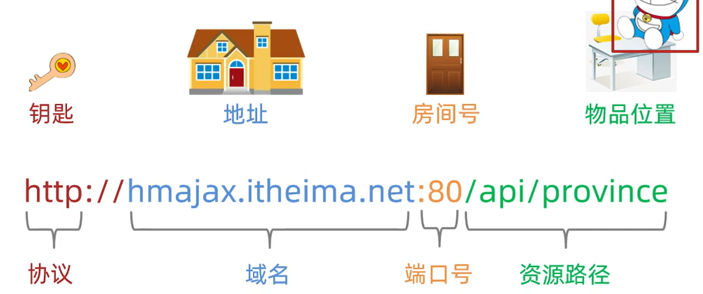


http协议**默认访问80端口**


# HTTP模块

该模块可以用于**创建web服务**在终端上运行

在浏览器输入http://localhost:端口号/ 可以访问到创建的web服务 **ctrl+c**停止服务

res.end表示服务器已经完成了**对客户端的响应**，在把参数中的**数据传递给客户端**后将**不再发送**任何数据

```javascript
// 首先引入http模块
const http = require('http')
// 创建web服务对象
const serve = http.createServer()

// web服务对象监听request(发送请求) req是请求参数 res是响应参数
serve.on('request', (req, res) => {
    res.end('hello mode.js')
})

// 此外还要监听端口号 第一个参数是端口号 回调函数实际上并不会做什么特别的事
serve.listen(3000, () => {
    console.log('端口运行中')
})
```


**const qs = require('querystring')** 该模块下的**parse**方法可以将url资源地址的参数**pname=xx&cname=xx&area=xx**转化为一个对象**{pname:xx,cname:xx,area:xx}**


省份城市接口，访问指定的资源地址会返回数据，实际是通过在监听到请求时**读取文件夹下的数据**然后 返回该数据

```javascript
const path = require('path')
const fs = require('fs')
const http = require('http')
const qs = require('querystring')
const sever = http.createServer()


sever.on('request', (req, res) => {
    // 请求参数中的url属性储存了请求的资源路径 可以进行判断

    // 省份数据
    if (req.url === '/api/province') {

        // 读取文件
        fs.readFile(path.join(__dirname, '/data/province.json'), (err, data) => {
            if (err) return res.end('请求失败')
            // 设置响应头
            res.setHeader('Content-Type', 'application/json;charset=utf-8')

            // 设置返回格式
            const obj = {
                message: '获取省份数据成功',
                list: data.toString()
            }

            // 返回数据 注意数据必须是字符串格式
            res.end(JSON.stringify(obj))
        })
    }
    // 城市数据接口 对带有参数的资源地址先匹配前缀
    else if (req.url.startsWith('/api/city')) {
        // 取出参数部分
        const querySearch = req.url.split('?')[1]
        // 通过querysearch模块将参数转化为对象形式

        const str = qs.parse(querySearch)

        const pname = str.pname
        fs.readFile(path.join(__dirname, '/data/city.json'), (err, data) => {

            if (err) return res.end('请求失败')
            res.setHeader('Content-Type', 'application/json;charset=utf-8')
            data = data.toString()
            console.log(JSON.parse(data)[pname]);

            // console.log(data)
            const obj = {
                message: '获取城市数据成功',
                list: JSON.parse(data)[pname]
            }
            res.end(JSON.stringify(obj))
        })
    }
    else res.end('请输入正确的路径')
})
sever.listen(3000, () => {
    console.log('端口开始运行')
})  
```


不仅可以返回普通的数据还可以返回**html**执行相应的功能，不过依旧是是读取文件内容然后按**字符串形式**输出


# 模块化

使用node.js导入需要遵循CommonJs语法


在导出文件中需要用**module.expors指定一个对象**，对象中是要**导出的属性和方法**，对象的键是向外展示的名称，该方法无法**按需导出**

```javascript
const url = 'http://hmajax.itheima.net'
const getArray = arr => arr.reduce((pre, cur) => pre + cur, 0)

module.exports = {
    url,
    getArray
}
```

使用**require**导入文件，如果是内置的文件可以直接导入名称，**反之需要写路径名**


除了CommonJs标准还有**ECMAScript**标准，但node.js默认是**不支持该规范**的需要先配置**json**——在当**前文件夹下**创建**package.json**文件，写入

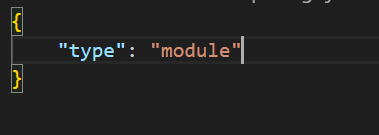

注意json中必须用**双引号**包裹，且**不能有注释**


导出

```javascript
const url = 'http://hmajax.itheima.net'
const getArray = arr => arr.reduce((pre, cur) => pre + cur, 0)

export default {
    url, getArray
}
```


用**import**导入

```javascript
import obj from './test3.js'
console.log(obj.getArray([1, 2, 3, 4]));
```


ECMAScript可以按需导出

```javascript
export const url = 'http://hmajax.itheima.net'
export const getArray = arr => arr.reduce((pre, cur) => pre + cur, 0)
```

```python
import { url, getArray } from './test3.js'
console.log(getArray([1, 2, 3, 4]));
```


两种导出可以**混合**使用


# 包

项目包：主要用于编写项目和业务逻辑

软件包：封装**工具和方法**


包的根目录下必须有**package.json**文件，记录包的清单信息

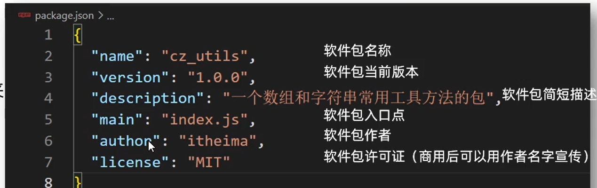

导入软件包的时候默认引入**index.js**模块文件**/main属性指定的模块文件**


包的结果如下

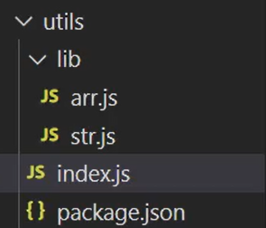


在index.js文件中导入各种方法然后**再全部导出**，可以使用结构的方法

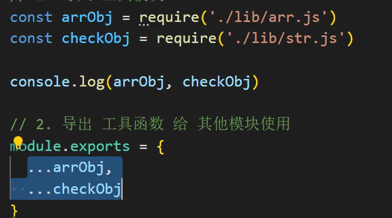


# npm-软件包管理器


+ 初始化项目清单文件 **npm init -y** 如果已有package.json可以忽略 如果不加**-y**则需**手动输入清单信息**
+ **npm i 软件包名称** 远程下载软件包

下载后可以直接**require()导入模块名**


在项目中如果带上模块传输会比较大，因此一般都是不带模块文件，但是**给清单文件以供在线下载**，当项目中缺少模块时，可以直接用**npm i下载所有缺少的模块**，该命令首先会去查看package.json找到所需的**依赖模块**，然后找到package-lock.json找到**模块的版本**，最后进行下载。

node 文件名可以执行文件

除了本地软件包，还有全局软件包即**本机所有项目使用**，封装命令和工具，存在于系统设置的设置。

命令**node i -g nodemon**安装nodemon， **nodemon用于代替node命令** 代码修改后只要**保存**就会**立即执行**而无需再调用node命令，可以**ctrl+c**退出，如果系统阻止了运行该脚本则参考https://blog.csdn.net/weixin_44151974/article/details/105431262解决


**npm uni 软件包**删除包，加上**-g**可以删除全局包


# Express框架

一个极简的web开发框架

注意先下载express软件包

```javascript
// 导入对象
const express = require('express')
// 创建服务对象
const server = express()

// 监听请求
server.get('/', (req, res) => {
    // 无需设置响应头 能够返回中文
    res.send('爱来自礼堂')
})
// 监听所有没有设置过的请求
server.all('*', (req, res) => {
    // 设置状态码
    res.status(404)
    res.send('资源不存在')
})

server.listen(3000, () => {
    console.log('服务已启动');
})
```


# 浏览器的同源策略

该策略限制一个源对另外一个源的**交互**，只有网页加载时的源和Ajax请求的源（**协议端口域名**）全部**相同**时才是同源，用于保护浏览器中**网站的安全**，限制 Ajax只能向**同源URL**发送请求


# 跨域

网页加载所在源和Ajax的源(**协议域名端口**)只要有一个不同，就发生了跨域访问，请求的访问会失败，会报出**CORS**错误，注意**浏览器直接访问（不通过JS）**不会被限制。

在前后端分离的项目中，**前后端不在一个源**如果不进行设置则无法得到数据

​			

解决方法是：在服务器端设置**Access-Control-Allow-Origin响应头字段**允许其他源可以访问自己的资源，首先要安装**cors软件包**

```javascript
const cors = require('cors')
server.use(cors())// 会设置响应头字段
```

或者设置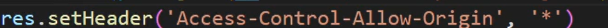


注意上述方法是在**开发阶段**使用，上线部署时需采用**同源访问**


# Webpack

是一个用于现代JS程序的静态模块打包工具，用于前端工程化，只有和入口文件有关联的的才会被操作

命令后缀**--save-dev**表示非全局下载，可以用**-D**替代


步骤如下：

+ 新建项目文件夹，初始化包环境
+ 项目文件夹下新建csr文件夹，里面是主要逻辑代码，导出导入使用ECMA语法

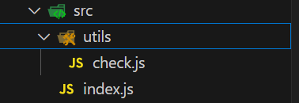


+ 下载webpack和webpack-cli——**npm i webpack webpack-cli --save-dev**这里不进行全局下载
+ 项目中运行工具命令，采用**自定义命令**的方式，在package.json中添加**"build":"webpack"** 然后执行命令**npm run build**，**build**可以自定义

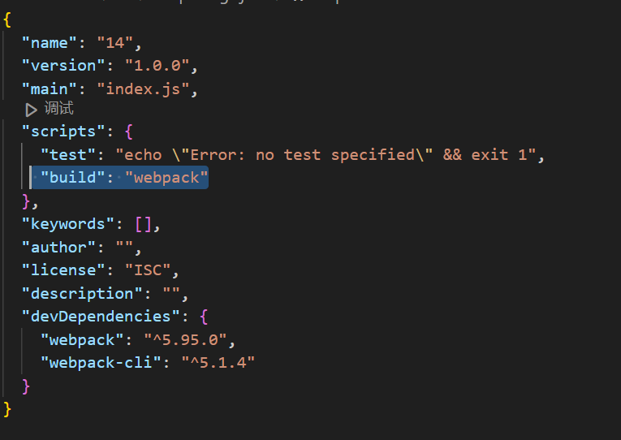

+ 会生成dist文件夹，存放最终结果的文件夹，内部有一个mian.js即压缩和优化后的js文件，而**html行和css需要手动**放入dist


webpack的**默认入口是./src/index.js，默认的出口是./dist/main.js**，这是可以被修改的

+ 在项目根目录下新建webpack.config.js配置文件
+ 导出配置对象，配置入口出口文件路径

```javascript
// 导入模块
const path = require('path');

module.exports = {
    // 入口 webpack编译的是哪个主文件
    entry: './path/to/my/entry/file.js',
    // 出口 编译后生成的新文件创建到哪里
    output: {
        // 输出文件的位置
        path: path.resolve(__dirname, 'dist'),
        // 文件名
        filename: 'my-first-webpack.bundle.js',
        // 清空dist目录 可选
        clean: true
    },
};
```


手动导入html文件比较麻烦，可以自动生成html文件

+ 下载插件**npm i html-webpack-plugin --save-dev**
+ 配置wenpack.config.js文件，在配置完成后，进行打包时会自动生成一个**导入了js**的html文件(放在public文件夹下)，且这个文件是**压缩**好的

```javascript
// 导入模块
const HtmlWebpackPlugin = require('html-webpack-plugin');
const path = require('path');

module.exports = {
    entry: './src/index.js',
    output: {
        path: path.resolve(__dirname, 'dist'),
        filename: 'main.js',
    }, 
    plugins: [ // 插件列表
    new HtmlWebpackPlugin({
      template: path.resolve(__dirname, 'public/index.html'), // 以指定的 html 文件作为生成模板
      minify: { // 添加 minify 配置来压缩 HTML
        collapseWhitespace: true, // 去掉空格
        removeComments: true, // 移除注释
        removeRedundantAttributes: true, // 删除冗余的属性，比如 <input type="text">
        removeScriptTypeAttributes: true, // 删除 <script> 标签中的 type="text/javascript"
        removeStyleLinkTypeAttributes: true, // 删除 <link> 标签中的 type="text/css"
        useShortDoctype: true, // 使用短的 DOCTYPE 替代完整的
      }
    })
  ],
};
```


打包CSS文件

+ 将CSS文件引入到入口文件中 使用**import**操作方法**import './css/index.css'** CSS文件一般放在**src下的CSS文件夹中** 
+ 下载相应的插件——**npm install --save-dev css-loader style-loader**

+ 配置webpack.config.js 文件让webpack有加载器的功能

 

```javascript
const path = require('path');
const HtmlWebpackPlugin = require('html-webpack-plugin');

module.exports = {
  entry: path.resolve(__dirname, 'src/index.js'), // 入口
  output: { // 出口
    path: path.resolve(__dirname, 'dist'),
    filename: 'app.js',
    clean: true // 先清空 dist，然后再输出最新内容
  },
  plugins: [ // 插件列表
    new HtmlWebpackPlugin({
      template: path.resolve(__dirname, 'public/index.html') // 以指定的 html 文件作为生成模板
    })
  ],
  module: {
    rules: [
      // test选择那个 user使用那个加载器 注意下面的顺序不能反
      { test: /\.css$/i, use: ["style-loader", "css-loader"] },
    ],
  },
};
```


打包less

+ 将less引入到入口文件中 一般放在src下的**less**文件夹中 **导入方式与css一致**

+ 下载软件包 **npm i less less-loader --save-dev**
+ 配置webpack.config.js **{ test: /\.css$/i, use: ["style-loader", "css-loader","less-loader"] }**


打包图片

+ 图片素材放在src下的assets中，在css或less文件中用图片修饰
+ 在文件入口中导入图片 例如**import img from './assets/logo.png'**，如果是在**less/css中修饰**的只要**导入了less/css就无需再导入图片**
+ 配置webpack.config.json文件 图片无需下载加载器

```javascript
{ // 针对资源模块（图片，字体文件，图标文件等）处理
    test: /\.(png|jpg|jpeg|gif)$/i,
    type: 'asset', // 根据文件大小（8KB）
    //小于：把文件转成 base64 打包进 js 文件中（减少网络请求次数）大于：文件复制到输出的目录下
    generator: { 
        // 输出文件时，路径+名字
        filename: 'assets/[hash][ext]'}
```

这样图片会被一起打包，较大的图片会放到dist下的assets中，较小的会被直接放入html中


# babel编译器

是一个javascript语法编译器，可以使js代码兼容低版本浏览器  ES6->ES5	


+ 下载babel babel-loader core本地软件包 **npm install -D babel-loader @babel/core @babel/preset-env**
+ 配置webpack.config.js文件

```javascript
{
    test: /\.m?js$/,
        exclude: /(node_modules|bower_components)/,
            use: {
                loader: 'babel-loader',
                    options: {
                        presets: ['@babel/preset-env'],
                    },
            },
},
```


# AXIOS

AXIOS也可以通过npm下载 **npm axios** 下载后的axios需要在js中导入 **import axios from 'axios'**


# Webpack热更新

当在开发过程中修改代码时，`webpack-dev-server` 会自动重新打包，**并在浏览器中实时反映修改**，但是该命令不会生成dist文件夹因为它将内容保存在内存中。

+ 下载软件包 npm i -D webpack-dev-server 
+ 配置自定义命令

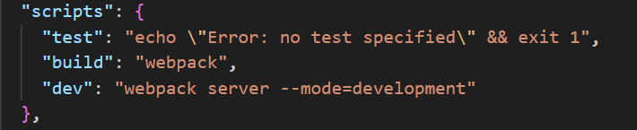


# 打包模式


这里压缩的代码指的是在dist下的js代码


在package.json中设置

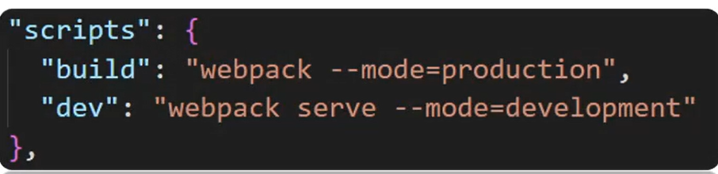


# 开发环境调错

代码被**压缩混淆**的时候无法正确定位到**源代码**的位置，可以在webpack.config.js中设置 **devtool: 'inline-source-map'**

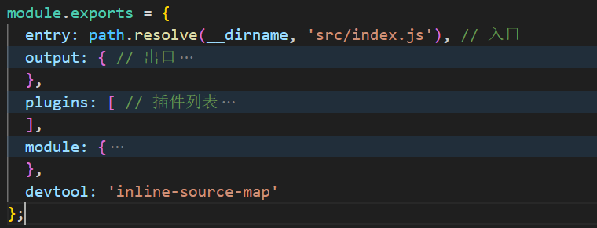


这样报错时的行数会定位到**源文件**中而不是打包后的**js文件**中


# 路径别名

在webpack.config.js中可以设置路径别名

```javascript
 resolve: {
    alias: {
      // 要设置的别名，注意替代的路径不能以/结尾，在其他文件中导入路径时可以用别名替代
      Myutils: path.resolve(__dirname, 'src/utils'),
      // 也可以是一个字符 
     '@': path.resolve(__dirname, 'src')
    },
  },
```

