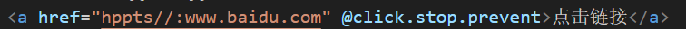
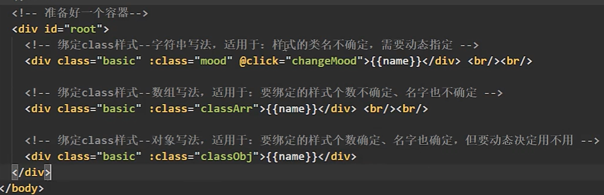
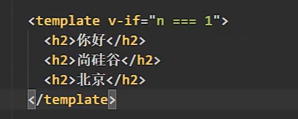
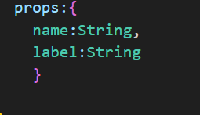

# Vue

Vue是一套用于**构建用户界面**的**渐进式**JS框架

+ 采用**组件化(.vue文件)模式**，提高代码复用率，让代码更好维护

+ **声明式**编码，可以无需操作DOM元素
+ **虚拟DOM+优秀的diff算法**


# 安装

下载**Vue的开发者工具**，在Chrome扩展商店中下载，通过开发者工具可以方便**调试**

+ 直接使用script引入(官网下载) 有两个版本一是开发版本(有警告和提示)，而是生产版本(体积更小但是但移除了提示和警告)
+ 使用NPM包管理器下载


# Hello案例

容器与Vue实例之间是**一对一**的关系

容器中可以替换的内容放**JS表达式(结果是一个值)**


# el和data的两种写法

通过vue实例的**$mount**方法**绑定容器**


data的函数式写法(必须是**普通函数的形式**)，函数必须返回一个**对象**，这个函数的调用者是Vue实例


简写形式


# 模板语法

+ 插值语法，Hello案例中演示的**{{}}语法**，用于**标签体内容**，内部可以放一个**data中存储的变量**或者**methods中的方法不能省略括号**
+ 指令语法，用于**设置解析标签(标签属性，)**，**v-???形式**，例如：v-bind：在标签属性前加上**v-bind: **可以简写为**:**，会将属性的值解析为**JS表达式**，注意v-bind实现的是**单项绑定(数据只能从data流向 页面)**


# 数据绑定

v-bind指令（一般简写为**:属性名="某一个变量"**）但只能实现数据的单项绑定

**v-model**可以做到**双向绑定**，即在页面中输入内容(表单时)Vue实例中的**属性也会一起变化**，但是注意v-model只能应用在**表单类元素上(输入类元素)** **v-model:value=“xx”**可以简写为**v-model="xx"**


# MVVM模型

Vue的创建参考了MVVM模型              

M model模型 对应data中的数据；V view视图 模板；VM视图模型  Vue实例对象，所以一般Vue实例对象叫**vm**；


**数据经过绑定放到视图中，视图通过监听将修改映射回数据。**


data会被存放到**Vue._data**中，data内的数据会通过**数据代理**挂载到Vue下，因为模板中只能访问到**Vue的直接属性**


# 虚拟DOM

虚拟DOM是对真实DOM的**一层抽象**，DOM是非常庞大的，对DON的**直接操作**会导致页面的性能问题，因为浏览器会**从头到尾重新构建一遍**，而虚拟DOM使用**diff算法**比较不同，**减少操作DOM带来的性能消耗**。


# 函数

所有被Vue管理的函数最好写成普通函数，这样this才能指向Vue实例

不被Vue管理的函数**(定时器的回调函数，ajax的回调函数)**，最好写成箭头函数，保证this指向Vue实例

# 数据代理

Object.defineProperty是 JavaScript 中用于在对象上定义或修改属性的工具

```js
Object.defineProperty(obj, prop, descriptor) // 要操作的对象 设置的属性 配置项
    <script>
        let number = 18
        const person = {
            name: '丁真',
            sex: 'man'
        }

        Object.defineProperty(person, 'age', {
            // value: '18',
            // enumerable: true, // 控制属性是否可以被枚举 默认是false
            // writable: true, // 控制属性是否可以被更改 默认是false
            // configurable: true, // 控制属性是否可以被删除 默认是false

            // 当读取person的age属性时 会调用该函数 且将age的值设置为返回值
            get: function () {
                return number
            },
            // 当修改age时，value是修改后的结果
            set: function (value) {
                number = value
            }
        })
        console.log(person);

    </script>
```


通过**Object.defineProperty**将对象的属性和一个其他变量/对象中的属性**联系**到一起


数据代理：通过一个对象**代理**另一个对象中的**属性**

```js
    <script>
        const obj1 = { x: 100 }
        const obj2 = { y: 200 }
        Object.defineProperty(obj2, 'x', {
            get: function () {
                return obj1.x
            },
            set: function (value) {
                obj1.x = value
            }
        })
    </script>
```


从data到_data做了一步数据代理


# 事件绑定

事件的基本使用：

+ 使用**v-on:xxx**，或者**@xxx**绑定事件，其中xxx是事件名如click，给xxx赋的**值是回调函数**，如果有参数直接**用括号包裹**，反之括号可以**省略**，也可以写一些**简单的语句(只能用vm中的属性)**

+ 事件的回调函数放在Vue的**method**下，注意不能使用**箭头函数**，虽然也可以放到data中但是这样会**多做一步数据代理**，但是对于函数是没有必要**修改**的

+ 回调函数的默认参数是**event对象**，如果**传递了参数就不能获取到event对象**，需要在回调函数调用的位置传递一个**占位符$event**


给子组件绑定事件需要用**native修饰符**，否则会被当做**自定义事件**，这个事件会被绑定到组件结构**最外部的div**中


# 事件修饰符


常用的数据修饰符：

+ prevent阻止默认事件
+ stop阻止事件冒泡
+ once事件只触发一次
+  capture使用事件捕获模式
+ self只有**触发的事件对象是标签本身**才会触发事件，可以用来阻止冒泡


修饰符可以**连写**




# 键盘事件

键盘事件有两种：**keydown和keyup**


可以在回调函数中对键盘输入做判断，或者**添加事件修饰符**，Vue对**常见的按钮**起了别名——**enter delete esc space tab(必须和keydown使用) up down left right**


还有一些系统修饰键**ctrl win shift alt**，搭配**keydown**可以正常使用，与**keyup**使用时需**再按下任意一个键**，随后**释放这个键**，然后**再释放**系统修饰键才能触发。


系统修饰符可以和其他键一起判断


对于**没有别名的按键**只能在回调函数中**判断键值**`if (event.key =\== 'y' || event.key === 'Y')` 


# 计算属性

计算属性是使用**data中的属性**计算出的**新的属性值**，存放在**computed**中


简写方式，确定了**只读不改**不需要setter函数，只需要在函数中返回相应的结果，如果对这个计算属性值做了双向绑定即会被**修改**，那么不能缺少getter/setter


# 监视属性

当属性变化时执行操作


如果**没有其他配置项**那么可以简写


监视属性也可以实现**计算属性**的效果


从上述的案例来看监视属性的写法**较为复杂**，但是监视属性是可以开启**异步任务**的，而计算属性不能。


# 绑定Class样式

要变化的样式使用**数据绑定**，这里的变量可以是一个**数组**，Vue会把样式最终**合并**为一个




# 绑定style样式

对内联的style样式进行**数据绑定**，变量是一个对象，并且对象的**键名**要**去掉-再用小驼峰**，可以用数组储存多个对象


# 条件渲染

v-show

 


和JS中一样 if也能搭配else-if,else 注意结构必须**要连续**不能被打断


对于同一个条件的判断


为了方便可以放到一个盒子中只使用一次判断


但是这种做法会破坏结构多添加了一个盒子，解决方案是使用**template**包裹，在加载结构时template不会出现，只会显示内部的内容，注意template只能与**v-if**使用




# 列表渲染

基本使用，这里没有解包操作 


需要保证**key值唯一**，如果不指定key值那么key值自动设置为索引值。

key的值需要考究，如果不对数据进行**更新**可以简单地将key值设置为**索引值**，但是如果会**修改数据**那么需要用数据中的**唯一值**作为key值，如果依然使用索引值会导致**数据错乱和低效**


当在数组首部添加了一条数据后，vue根据数据生成**新的虚拟DOM**，在转化为真实DOM之前会与**原来的虚拟DOM比较**，这里按照**Key值**选择比较的对象，**如果不同则会使用新的内容，如果相同则会复用内容**，但是注意，对于输入结构，**填入的内容是在真实DOM中的**，比较时只会看结构，因此在转化为真实DOM时，内容会继承**旧的DOM的文本内容**，这会导致数据错乱，并且有的数据没有复用导致效率低下。


# 列表过滤

实现输入不同的关键值，列表会显示对应的内容


首先应该获取到输入框的内容，使用**双向绑定**让输入内容可以改变Vue实例中对应的属性keyWord，初始时keyWord为空这样能匹配到所有的数据

展示在页面上的数据用**计算属性**来做，它是由原数组**按照关键词过滤后**得到的结果


计算属性可以用监视属性实现，这里将新数组作为属性存在Vue中，**监视keyWord的变化**然后修改新数组内容，注意这里为了一开始显示全部内容需要**初始化执行一次**


# 列表排序


在Vue实例中添加一个**新属性标识排序类别**，给按钮绑定点击事件，点击按钮**改变**该属性值，在计算属性中根据该属性对过滤后的数组排序


# Vue检测数据原理

Vue会在**第一次数据代理**的时候(data->_data)通过**setter**做监视，setter被触发后会重新渲染页面，但是对于**后添加的数据**是不会做监视的，需要使用set方法添加数据


对**数组**中的数据的监视比较特殊，如果数组中的元素是**对象**，修改**对象的值**会触发响应式，但把这个对象本身替换掉或删除是不会有反应的，因为数组是不会对其中的值做监视的，想要触发数组的响应式，就必须通过**API修改** push shift unshift splice....，这些API在是被**包装**过的，使用时会触发数组的响应式修改，修改数组的元素也可以通过**set()方法** **vm.$set(this.arr,0,'xxx)** 第二个参数是**元素位置**


注意set方法是不能往**vm下或vm的data**下直接添加数据的，只能往vm.data下的**对象/数组**中添加数据


# 收集表单数据

表单数据的收集是通过**双向数据绑定**实现的，对**文本类表单**v-model收集到的就是输入，对于**选择框一类**的，v-model**默认收集checked值**，需要指定**value**才能收集到实际值，如果v-model有初始值，因为双向绑定表单会有**默认值**，注意对于**复选框**，v-model需要绑定一个**数组**


一般将数据放到一个对象中，这样使用时就可以**避免_data**


v-model有修饰符：

+ 对于密码类输入，需要**先指定text="number"**，再给v-model指定**number**修饰符，这样会将收集到的数据转换为**数值型**
+ 对于文本框类输入，可以指定**lazy**修饰符，这样只有在文本框**失去焦点**时才会更新v-model绑定的值
+ 对于账号类输入，可以指定**trim**修饰符，这样可以删除多余的空格


# 过滤器

过滤器能实现的效果，**函数和计算属性**也能做到

在语法中用**|**分隔，后面是**过滤器函数**，在Vue中配置**filters**，最后将返回值作为**插值语法**中的结果


过滤器会默认使用**前面的变量作为参数**，如果写了小括号**传递其他参数**，那么也会将**第一个参数设置为前面的变量**


​	

过滤器可以**串联**，一层层地传递结果


注意目前所写的过滤器是**局部**的只能在**当前Vue实例管理的容器**中使用，全局的过滤器需要写在Vue上


要在**创建实例之前**完成


# 内置指令


## v-text

v-text 用属性**替换**结构的内容 不能**解析**标签


## v-html

v-html支持结构的**解析**

但是使用v-html需要注意**安全性**

## v-cloak

浏览器在解析HTML文件时，当遇到script标签时，**HTML的解析会暂停**，此时浏览器会发送HTTP请求下载JS文件，当**脚本下载完毕**浏览器会**解释执行**下载的JS文件然后再继续解析HTML文件，**因此HTML文件的执行时间与脚本的数量是相关的。**

因此当把**JS引入**放在**HTML结构后面**时，页面内又使用了**插值语法**，在加载页面的过程中，如果**JS加载时间过长**那么就会导致**结构显示混乱**


结构加上**v-cloak属性**，然后**搭配CSS样式**实现隐藏页面，当JS(**Vue**)加载完毕后，**Vue会自动将v-cloak属性删除**，这样原先被隐藏的结构就会显示出来。


## v-once

v-once指令所在的结构在初次渲染之后就是静态内容了，元素的变化不会再引起该结构的**响应式**了


## v-pre

该指令会阻止对结构的**编译**

## 自定义指令

用于**定义一些方法**然后**通过指令**的形式快速调用,**指令的this指向window**


指令名不能有**大写**，多个单词可以**用-隔开**


指令被放在**directives**中，在directives中指令名不用**v-**，如果指令名使用**-分隔**，定义时就需要用**引号包裹**即**字符串的形式**。 


有的操作只有在**插入页面后**才能生效，比如聚焦


在**vue实例**中定义的指令属于**局部指令**，与过滤器的实现方式一样——挂载在Vue上


# 生命周期

全称生命周期回调函数，即Vue在一些**关键时刻**调用的函数。


试想实现一个降低透明度然后重置的案例，如果在methods中定义这个定时器函数，然后在html中用插值语法调用，这样做的结果是由于元素值被改变导致模板重新渲染，模板重新渲染会调用定时器函数，而之前的定时器函数不会结束，就这样不断开启定时器。


想要实现上述效果需要使用生命周期函数


+ 将要创建数据代理，**此时无法访问到数据和方法**，beforeCreate()
+ 创建完毕，**可以访问到数据和方法**。create()
+ 将要挂载，此时还是**虚拟DOM**，页面上还是**未编译的DOM结构**，所有对**页面DOM的操作**最终都会**被覆盖**，beforeMounte()
+ 虚拟DOM转换为真实DOM，成功挂载到页面上，此时可以开启**定时器**，**axios请求**，**绑定自定义事件，订阅消息**，这里所做的操作只会**执行一次**，mounted()
+ 将要更新，beforeUpdate()
+ 更新完毕，update()
+ 将要销毁，此时可以访问到数据和方法，但是对数据的更新是**不会显示到页面**上的，**关闭定时器取消订阅等**，，beforeDestroy()
+ 销毁完毕，实例对象的销毁是不会影响到**绑定到原生DOM上的事件** 事件仍然会触发但不会**回显**，destroyed()


# 组件概述

传统的开发方式

存在代码依赖关系混乱和不好维护的问题，因为JS相互之间有依赖，必须按照一定的顺序引入，当JS文件较多时会很复杂

代码复用率不高，复制HTML结构不是在复用代码


组件是实现应用中**局部功能**的**代码和资源的集合**


# 非单文件组件

组件的本质是一个**VueComponent构造函数**，是**Vue.extend返回的**，每一个返回的构造函数都是**不一样**的。当写组件结构时，Vue会创建**组件的实例对象**，组件中的this指向**组件实例对象**。


组件名如果有多个单词，可以**用-隔开**或者使用**大驼峰(Vue脚手架)**


组件的创建可以简写**const school={}**，在Vue实例中配置组件时会**进行判断自动调用extend函数**


**组件中可以嵌套组件**，开发中一般把所有的组件用一个**app**组件管理


Vue对Vuecomponent原型对象的_\_proto__做了修改让它**指向Vue的原型对象**，这使得**Vuecomponent可以访问到Vue原型上的方法**


# 单文件组件

组件文件用**vue**作为后缀，内部包含三部分：template下写**结构**，script下写**动作**，style下写**样式**。在script中创建vue组件实例对象，完成后需要**向外导出**


一个大致的结构是：


组件要导入到app.vue中**被app组件统一管理**，main.js中是**项目的入口文件**，**管理app组件**，index.html中是展示的页面。


# Vue脚手架

浏览器无法识别vue文件，因此需要Vue脚手架来帮助搭建Vue项目 


全局安装

```
npm install -g @vue/cli
```


通过以下命令来创建一个新项目

```python
vue create hello-world
```

随后可以选择相应的设置


这样就得到了一个Vue项目


package.json中已经配置好了命令缩写

`npm run serve`会编译并开启一个小型的服务器，并对代码进行热更新

`npm run build`会打包压缩文件，一般是交付项目时使用


# render函数

在入口文件main.js配置Vue实例对象时，如果用**template渲染对象**会失败


因为导入的Vue是一个**阉割版**的，Vue本身是分为**核心**和**模板解析**的，在项目开发完毕后使用webpack打包后，所有的Vue相关的内容会被转化为html,js,css内容，也就是**不需要用到Vue中模板解析的部分**。

因此在引入时会将模板解析的部分忽略，所以在配置Vue实例时**不能使用template**。这里用**render**函数帮助渲染模板，render函数有一个参数，这个参数也是一个函数，作用是**h('h1',我是标题)**，因此将app传给render的参数。

使用了render就不需要再用**component导入组件**了 

如果导入的是完整的Vue文件，就可以使用template

**.$mount等同于el选择器**


# 修改脚手架配置属性

脚手架的配置属性都是**隐藏**起来的，想要**查看**配置文件的内容需要在**集成终端中**使用**vue inspect >output.js**


如果要修改配置属性需要操作package.json同级的**vue.config.js**，对vue.config.js做的修改会**覆盖**到webpack.json中的同名属性，但并不是所有的属性都能修改，具体见https://cli.vuejs.org/zh/config/#pages


Vue中采用**eslint**语法检查，如果出现了语法警告会直接导致**编译错误**，在配置文件中设置**lintOnSave**进行警告但不编译错误


对vue.config.js修改需要**重新运行项目**


# ref属性

Vue提供了一种快速操作DOM元素的方法，类似于CSS选择器的效果

通过**ref**指定标识符，类似于id，使用时操作**vm/vc实例对象**下的**$refs**查找**标识符**，得到的就是**DOM对象**


对组件标签进行**ref**标识，得到的是**组件实例对象**，如果用**id**标识操作JS，得到的是**DOM对象**。


# props属性

一个组件想要**复用**，数据就**不能写死**，应该要做到在调用时能**传输数据**，可以传入一个**常量**或者一个**变量对象或者函数**，后者需要使用**数据绑定**

通过props可以实现**父组件与子组件的交互**，也可以实现**子组件到父组件的交互**(父组件给子组件一个能修改自身属性的函数，子组件通过这个函数操作父组件中的元素)


在组件实例对象中配置**props**属性，值可以是一个**数组**里面存放**外部传入的属性**，属性会**挂载到组件实例对象**上(props的**优先级**高于**data**)，外部没有传入的元素默认是**undefined**，，组件内部要通过**this**使用，**模板**中可以直接调用。


**对象的写法**指定接受的参数的**类型**，防止调用者传入错误类型的参数




实际业务中可能需要**修改**外部传入的属性的值，但是Vue**不推荐**直接对该属性进行**修改**，这里对修改的**监视**是**浅层次**的，如果属性是一个**对象**那么**修改对象的值**是不会导致**报错**的，当属性**不是对象**形式的，对属性的修改会导致报错。

可以对该实例本身添加一个**新属性**接收外部传入的属性(props的**优先级更高**，因此可以用外部属性**初始化**data中的属性)。


# mixin混入

提取出组件中**共同的配置**放到一个JS文件中，该文件与components文件夹**同级**


在组件中**导入**该文件，配置对象中配置**mixins**，值是一个**数组**，因此可以传入**多个**组件


也可以全局配置`Vue.mixin(minjs2)`

这样所有的**Vue组件实例和vm对象**都会拥有提取出的公共配置，注意这里是**合**并，因此重名的函数或数据会**以实例对象为主**。

生命周期函数是一个例外，该函数不会被覆盖而是**都执行**，不过不知道为什么提取的公共生命周期函数**不起作用**


# 插件

插件是一个**对象**，内部有一个**install**函数，**Vue.use(插件)**会自动调用Install函数，该函数会收到Vue的构造函数，有了构造函数就可以做很多事情——全局指令，全局过滤器，全局混入...


# scoped样式

组件中样式可能会重叠，因此需要在**style标签中**加上**scoped**关键字，来保证组件中的样式**只会影响到这个组件本身**


# Todo-list案例

完成后界面如下


能实现以下功能

+ 添加任务
+ 勾选任务
+ 可以删除任务
+ 删除所有勾选任务
+ 全选/全不选


**Vue遵循组件化思想**，这个小项目可以分为四个组件——输入框，列表，底部，列表项，通过App组件管理子组件


# 组件自定义事件

在组件上绑定自定义事件还是使用事件语法:**v-on或者@**，事件名自定义，这个事件会被绑定到**组件实例对象**上，注意不是组件上，一旦事件触发则会调用**指定的函数**，可以实现子组件给父组件**传递数据**，因为回调函数在父组件中


在组件的内部使用**\$emit**触发自身的自定义事件，可以**传递参数**


另一种绑定自定义事件的方式是**使用ref标签**获取组件实例对象，然后再这个对象上调用**$on**


注意如果不想定义一个函数，在绑定回调函数时，需要用箭头函数


因为普通函数中的**this**会指向**组件实例对象**，而不是**自身**


如果事件只想**触发一次**，可以使用**事件修饰符**或者在绑定时用**\$once**


解绑使用**$off**，如果要解绑**多个**自定义事件，参数可以传入**数组**，**不传参则解绑所有**


# 事件总线

**可以实现任意组件间通信**

借助**组件实例对象可以访问到Vue原型上的属性和方法**的特性，在**Vue原型**上定义一个**Vue对象**，这样各个组件都可以**访问到**这个对象。组件实例对象在这个对象上绑定自定义事件的**回调函数是在自己身上**的，其他组件实例对象**触发这个自定义事件**时会触发**对应的回调函数**，由此将实现了不同组件间的通信。

一般的定义方法，命名为$bus


绑定事件，传入自身的回调函数


触发自定义事件


在绑定自定义事件时也要写好解绑函数


# 消息订阅与发布


