# Node.js

跨平台的**JS运行环境**，使开发者可以搭建服务端的JS程序，node中没有DOM和BOM但是也能使用JS语法

浏览器能执行JS程序是通过内部的**V8引擎**（C++程序）

在vscode中通过终端打开node.js文件然后执行**node 文件名**即可执行node.js文件 ，需要**先保存一下**


# fs模块

用于读写文件

```js
// 引入文件
const fs = require('fs')
console.log(fs)

// 写入文件 如果不存在则创建
fs.writeFile('file1.txt', 'hello node.js', err => {
    console.log(err);//如果写入成功则输出null
})

// 读取文件 读取的内容是一个Buffer数据流 需要转换为字符串形式
fs.readFile('file1.txt', (err, data) => {
    console.log(err);
    console.log(data.toString());
})

// 判断文件是否存在
fs.access(filename,err=>{
    if (err){
        xxx
    }
    else{
		xxx
    }
})
```


# Path模块

在fs模块中一般建议使用**绝对路径**，path模块可以帮助拼接

```javascript
const path = require('path')

// 输出当前所在的路径 D:\Microsoft VS Code\node
console.log(__dirname)

// 调用join方法拼接路径 D:\代码\index.html
let p = path.join('D:', '代码', 'index.html')
// ../会被自动识别 D:\Microsoft VS Code\test1.js
p = path.join(__dirname, '../test1.js')

console.log(p)
```


# 压缩html&&JS

压缩前端代码可以让浏览器加载网页**更快 **，属于前端工程化的一部分：压缩，转译，整合，测试，自动部署

做法：将Html文件中的**回车和换行**去除，然后写入新的文件中 注意这里的正则匹配需要**匹配全局**，然后对JS做同样的操作，最后**拼接到一起**

```javascript
const fs = require('fs')
const path = require('path')
// console.log(path.join(__dirname, '/dist/index.html'));

fs.readFile(path.join(__dirname, '/public/index.html'), (err, data) => {
    if (err) return console.log(err)
    // 替换换行和回车
    const s = data.toString().replace(/[\r\n]/g, '')
	
    fs.readFile(path.join(__dirname, '/public/index.js'), (err, data) => {
        if (err) return console.log(err);
        // 替换换行和回车后在筛出无用的输出
        const res = data.toString().replace(/[\r\n]/g, '').replace(/console.log\('.+?'\);/g, '')
        // 引入到Html中
        const js = `<script>${res}</script>`
        fs.writeFile(path.join(__dirname, '/dist/index.html'), s + js, err => {
            if (err) return console.log(err);
            else console.log('压缩成功');
        })
    })

})
```


# URL端口号

端口号区分服务器里对应的**服务程序** 注意0-1023和一些特定的端口号被占用了，**编写程序时需要避开**


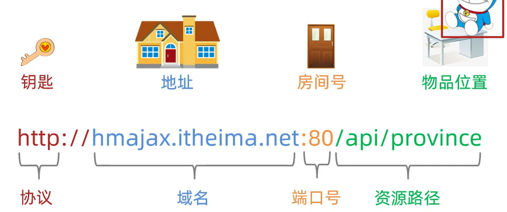


http协议**默认访问80端口**


# HTTP模块

该模块可以用于**创建web服务**在终端上运行，首先在**终端上启动程序**然后浏览器发送请求就能访问到相应的服务 **ctrl+c**停止服务

## 基本使用

创建后会接收到**相应端口**的**所有请求**

```javascript
// 导入模块
const http = require('http');
const url = require('url');
const path = require('path');
const fs = require('fs');

// 创建服务
const server = http.createServer((req, res) => {
    // 从url中获取路径名
    const pathname = url.parse(req.url).pathname;

    console.log(pathname);

    // 根据路径不同做出不同的响应
    switch (pathname) {
        case '/index.html':
            // 读取文件内容并返回
            fs.readFile(path.resolve(__dirname, 'public', 'index.html'), (err, data) => {
                if (err) {
                    // 往响应体中写内容
                    res.writeHead(500, 'Internal Server Error', {
                        'Content-type': 'text/html;charset=utf-8'
                    });
                    // 返回响应体
                    res.end('<h1>500 服务器发生未知错误！ </h1>')
                } else {
                    res.end(data);
                }
            });
            break;
        case '/learn.html':
            fs.readFile(path.resolve(__dirname, 'public', 'learn.html'), (err, data) => {
                if (err) {
                    res.writeHead(500, 'Internal Server Error', {
                        'Content-type': 'text/html;charset=utf-8'
                    });
                    res.end('<h1>500 服务器发生未知错误！ </h1>')
                } else {
                    res.end(data);
                }
            });
            break;
        case '/videos.html':
            fs.readFile(path.resolve(__dirname, 'public', 'videos.html'), (err, data) => {
                if (err) {
                    res.writeHead(500, 'Internal Server Error', {
                        'Content-type': 'text/html;charset=utf-8'
                    });
                    res.end('<h1>500 服务器发生未知错误！ </h1>')
                } else {
                    res.end(data);
                }
            });
            break;
        case '/dist/css/bootstrap.min.css':
            fs.readFile(path.resolve(__dirname, 'public', 'dist/css/bootstrap.min.css'), (err, data) => {
                if (err) {
                    res.writeHead(500, 'Internal Server Error', {
                        'Content-type': 'text/html;charset=utf-8'
                    });
                    res.end('<h1>500 服务器发生未知错误！ </h1>')
                } else {
                    res.end(data);
                }
            });
            break;
        default:
            // 经典404
            res.writeHead(404, 'Not Found', {
                'Content-type': 'text/html;charset=utf-8'
            });
            res.end('<h1>404 您访问的页面不存在！</h1>')
    }
});

// 启动服务 监听端口
server.listen(8080, () => {
    console.log('http server is running on 8080');
});
```


## 解析url

**const qs = require('querystring')** 该模块下的**parse**方法可以将url资源地址的参数**pname=xx&cname=xx&area=xx**转化为一个对象**{pname:xx,cname:xx,area:xx}**

url模块下的parse()方法可以将网址转换为一个对象

```js
const parsedUrl = url.parse('https://example.com:8080/path?query=123#hash');
console.log(parsedUrl);
// 输出：
// {
//   protocol: 'https:',
//   slashes: true,
//   host: 'example.com:8080',
//   port: '8080',
//   hostname: 'example.com',
//   hash: '#hash',
//   search: '?query=123',
//   query: 'query=123',
//   pathname: '/path',
//   path: '/path?query=123',
//   href: 'https://example.com:8080/path?query=123#hash'
// }
```


## 设置响应头

```js
响应对象.setHeader('键', '值');
```

```js
// 同时设置 响应状态码 响应状态描述 响应头
响应对象.writeHead(响应状态码, '响应状态描述', {
    '键':'值',
    '键':'值',
    '键':'值',
})
```

## 设置响应体

```js
响应对象.write('内容')；
响应对象.write('内容')；
响应对象.write('内容')；
```

## 结束响应

```js
// 结束响应
响应对象.end();

// 向响应体写入内容并结束响应
响应对象.end('<hr><h2>结束<h2>');
```


## 案例

省份城市接口，访问指定的资源地址会返回数据，实际是通过在监听到请求时**读取文件夹下的数据**然后 返回该数据

```javascript
const path = require('path')
const fs = require('fs')
const http = require('http')
const qs = require('querystring')
const sever = http.createServer()


sever.on('request', (req, res) => {
    // 请求参数中的url属性储存了请求的资源路径 可以进行判断

    // 省份数据
    if (req.url === '/api/province') {

        // 读取文件
        fs.readFile(path.join(__dirname, '/data/province.json'), (err, data) => {
            if (err) return res.end('请求失败')
            // 设置响应头
            res.setHeader('Content-Type', 'application/json;charset=utf-8')

            // 设置返回格式
            const obj = {
                message: '获取省份数据成功',
                list: data.toString()
            }

            // 返回数据 注意数据必须是字符串格式
            res.end(JSON.stringify(obj))
        })
    }
    // 城市数据接口 对带有参数的资源地址先匹配前缀
    else if (req.url.startsWith('/api/city')) {
        // 取出参数部分
        const querySearch = req.url.split('?')[1]
        // 通过querysearch模块将参数转化为对象形式

        const str = qs.parse(querySearch)

        const pname = str.pname
        fs.readFile(path.join(__dirname, '/data/city.json'), (err, data) => {

            if (err) return res.end('请求失败')
            res.setHeader('Content-Type', 'application/json;charset=utf-8')
            data = data.toString()
            console.log(JSON.parse(data)[pname]);

            // console.log(data)
            const obj = {
                message: '获取城市数据成功',
                list: JSON.parse(data)[pname]
            }
            res.end(JSON.stringify(obj))
        })
    }
    else res.end('请输入正确的路径')
})
sever.listen(3000, () => {
    console.log('端口开始运行')
})  
```


不仅可以返回普通的数据还可以返回**html**结构，不过依旧是是读取文件内容然后按**字符串形式**输出


# 导出导入


## CommentJs

node.js的导出导入**默认**遵循**CommonJs**语法

在导出文件中需要用**module.exports指定一个对象**，对象中是要**导出的属性和方法**，对象的键是向外展示的名称，该方法无法**按需导出**

```javascript
const url = 'http://hmajax.itheima.net'
const getArray = arr => arr.reduce((pre, cur) => pre + cur, 0)

module.exports = {
    url,
    getArray
}
```

导入使用**require**，对于**内置**的文件可以直接导入名称，**反之需要写路径名**


## ECMAscript

除了CommonJs标准还有**ECMAScript**标准，但node.js默认是**不支持该规范**的需要先配置**json**——在当**前文件夹下**的**package.json**文件，注意json中必须用**双引号**包裹，且**不能有注释**

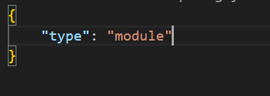


在 HTML 中，可通过在**script**标签中`type="module"`


**默认导出**，在导入时可以为模块**指定任意名称**，通过**.**调用模块内部的**方法和属性**，但只能导出**一个**

```javascript
const url = 'http://hmajax.itheima.net'
const getArray = arr => arr.reduce((pre, cur) => pre + cur, 0)

export default {
    url, getArray
}

import obj from './test3.js'
console.log(obj.getArray([1, 2, 3, 4]));
```


可以按需导出，但导入时需要**相同**的名字

```javascript
export const url = 'http://hmajax.itheima.net'
export const getArray = arr => arr.reduce((pre, cur) => pre + cur, 0)


import { url, getArray } from './test3.js'
console.log(getArray([1, 2, 3, 4]));
```


两种导出可以**混合**使用


# 包

项目包：主要用于编写项目和业务逻辑

软件包：封装**工具和方法**


包的根目录下必须有**package.json**文件，记录包的清单信息

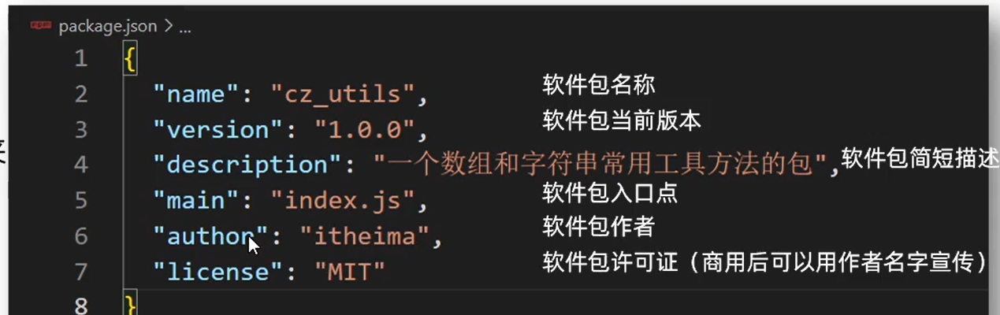

导入软件包的时候默认引入**index.js**模块文件**/main属性指定的模块文件**


包的结果如下

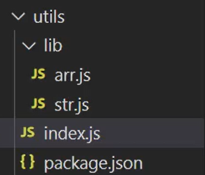


在index.js文件中导入各种方法然后**再全部导出**，可以使用解构的方法

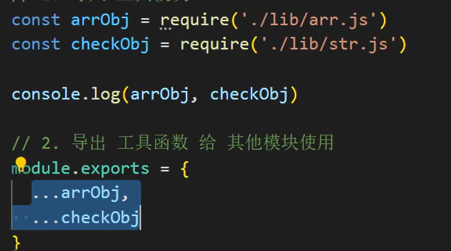


# npm

npm是 Node.js 的标准包管理器，最初是一种下载和管理 Node.js 包依赖的方法，但后来也成为前端 JavaScript 中使用的工具。

在项目中如果带上模块传输会比较大，因此一般都是给**清单文件**以供在线下载**，当项目中缺少模块时，可以直接用**npm i下载所有缺少的模块**，该命令首先会去查看package.json找到所需的**依赖模块**，然后找到package-lock.json找到**模块的版本**，最后进行下载，**如果没有package.json文件，将不会下载任何东西。

```python
npm i <package-name>

该命令可以添加更多标志
--save-dev 安装并将条目添加到 package.json 文件 devDependencies

--no-save 安装但不将条目添加到 package.json 文件依赖

--save-optional 安装并将条目添加到 package.json 文件 optionalDependencies

--no-optional 将阻止安装可选依赖
```


更新软件包

```python
npm update 将检查所有软件包是否有满足版本控制约束的较新版本
npm update <package-name> 指定要更新的单个包
```


除了普通下载之外，`npm` 还管理版本控制，因此你可以指定软件包的任何特定版本，或者要求高于或低于你需要的版本。

```python
npm install <package-name>@<version>
```


运行任务，package.json 文件支持一种格式，用于指定可以使用以下方式运行的命令行任务

```python
npm run <task-name>

{
  "scripts": {
    "start-dev": "node lib/server-development",
    "start": "node lib/server-production"
  }
}

因此，你无需输入那些容易忘记或输入错误的长命令
npm run watch
npm run dev
npm run prod
```


# 从命令行运行 Node.js 脚本


node 文件名可以执行文件

除了本地软件包，还有全局软件包即**本机所有项目使用**，封装命令和工具，存在于系统设置的设置。

命令**node i -g nodemon**安装nodemon， **nodemon用于代替node命令** 代码修改后只要**保存**就会**立即执行**而无需再调用node命令，可以**ctrl+c**退出，如果系统阻止了运行该脚本则参考https://blog.csdn.net/weixin_44151974/article/details/105431262解决


# Express框架

一个极简的web开发框架

## 基本使用

注意先下载express软件包

```javascript
const path = require('path') 
const express = require('express') //导入exopress对象

const app = express() // 创建实例对象

// 监听get请求
app.get('/', (req, res) => {
    // send方法返回数据，可以返回html结构
    res.send(
        `<h1>欢迎访问本网站！</h1>
    <hr>
    <a href="/login">登录</a>`
    )
})
// Express框架有sendFile方法可以直接返回文件，而不是用fs读取后返回
app.get('/login', (req, res) => {
    res.sendFile(path.resolve(__dirname, './pages/login.html'))
})

// 监听端口
app.listen(80, () => {
    console.log('开始监听端口');
})
```

这样的请求返回的html文件是不包括的其中css引入或图片引入的，因为引入也属于一种请求，而演示中只处理了html的请求。


## 路由匹配方式

```js
// 精确匹配，只能匹配 /home/index
app.get('/home/index', (req, res) => {
    res.send('<h1>这里是首页</h1>' + req.url);
});

// 字符串模糊匹配 *表示匹配所有字符任意多次 +和?与正则一样
app.get('/admin/*', (req, res) => {
    res.send('<h1>这里是字符串的模糊匹配</h1>' + req.url);
});

// 正则模糊匹配 匹配以.html结尾的请求 注意转义
app.get(/\.html$/, (req, res) => {
    res.send('<h1>正则的模糊匹配成功！</h1>' + req.url);
});

// URL中带参数  /news/23112  /news/abab
app.get('/news/:id', (req, res) => {
    res.send('<h1>带参数的路径！</h1>' + req.params.id);
});


// 字符串的模糊匹配 * 表示任意数量的任意字符
// 写在最后，如果前面的路由都没有匹配到 设置 404 页面
app.all('*', (req, res) => {
    res.status(404).send('<h1>404 您要找的页面不存在！</h1>');
});
```


## 组合路由

对同一个路径的**不同请求方式**同时处理

```python
app.route('/login')
    .get((request, response) => {
        response.sendFile(path.join(__dirname, 'pages', 'login.html'));
    })
    .post((request, response) => {
        response.send('提交成功！');
    });
```


## 请求


### 请求头基本信息

```js
request.ip
request.url
```


### 路径参数

请求参数下的**params**对象内保存了**监听url**所有的资源路径参数

```js
app.get('/news/:date/:id.shtml', (request, response) => {
    const data = `
    <h1>news</h1>
    <p>date： ${request.params.date}</p>
    <p>id： ${request.params.id}</p>
    `;
    console.log(request.params);  // 对象 date 和 id 是属性名
    response.send(data);
})
```

### 表单参数

在表单的<form action="/form" method="post">中指定**action为路径**，则在提交完表单后会去**访问这个地址**同时路径中会**携带表单参数**例如/submit?wd=1&type=4&origin=google

通过req.query;对象可以查询这些参数。


### 请求体

想要获得请求体需要通过**中间件**，需先下载**body-parser**

```js
const bodyParser = require('body-parser');
app.use(bodyParser.urlencoded({ extended: false }));

app.post('/login', (request, response) => {
    console.log(request.body);  // 对象
    response.send('提交成功！');
});
```


## 响应


### 设置响应状态码

```js
response.status(404);
```

### 设置响应头

```js
response.set('响应头key', '值');
```


### 响应体

```
response.end()
response.send()				比起 end() 可以自动添加 Content-type 响应头
response.sendFile(文件地址)	  将文件中的内容读取作为响应体
response.download(文件地址)	  将文件下载
response.json()				将对象转为json字符串，进行响应
response.jsonp()			将对象转为jsonp调用形式，进行响应
response.render()			渲染模板
```


### 重定向

```
response.redirect()			重定向
```


## 中间件

Express就是一个由路由和中间件组成的web开发框架，中间件是一个**函数**，它的参数有**请求对象，响应对象，指向下一个函数的指针**

功能包括：

+ 执行任何代码
+ 修改请求和响应对象
+ 结束响应
+ 调用下一个中间件


如果中间件没有结束响应，那么必须调用**next()**将控制权交给**下一个中间件**，否则请求会被挂起，路由的**回调函数**也是一个中间件


### 应用级中间件

**绑定在app.use()中**

创建一个**单独的模块**，定义中间件的代码

```js
const moment = require('moment');
const fs = require('fs');
const path = require('path');

module.exports = (req, res, next) => {
    // 从请求报文中获取信息
    const ip = req.ip.slice(7);
    const method = req.method;
    const url = req.url;
    const dt = moment().format('YYYY-MM-DD HH:mm:ss');
    
    // 拼接日志内容
    const logMsg = `${ip} ${dt} ${method} ${url}\n`;
    console.log(logMsg);

    // 写入文件
    fs.appendFile(path.resolve(__dirname, '../logs/access.log'), logMsg, err => {
        if (err) {
            throw err;
        }
        // 成功写入日志 放行
        next();
    });
};
```

在入口文件挂载中间件

```js
// 导入自定义中间件
const accessLog = require('./middleware/accesslog');

// 创建服务
const app = express();

// 在所有路由方法的前面
// 挂载访问日志中间件
app.use(accessLog);
```


### 错误处理中间件

使用中间件出现错误时会同时在**浏览器中直接显示**错误信息

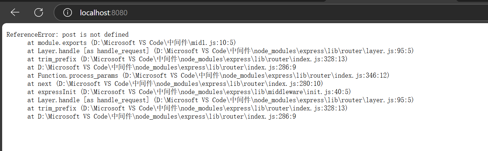

这里的中间件需要**四个参数**，挂载到**所有路由方法之后**

```python
app.use(function(err, req, res, next) {
  console.error(err.stack);
  res.status(500).send('Something broke!');
});
```


### 路由级中间件

所有的路由请求也可以作为一个中间件


将路由作为一个单独的模块然后导出

```js
const express = require('express')
const router = express.Router()
router.get('/', (req, res) => {
    res.send('<h1>爱来自理塘</h1>')
})
router.get('/index', (req, res) => {
    res.send('<h1>这是主页</h1>')
})
router.get('/login', (req, res) => {
    res.send('<h1>这是登录</h1>')
})

module.exports = router
```

之后在入口文件中导入挂载

```js
// 导入路由模块
const indexRouter = require('./routes/index');
const loginRouter = require('./routes/login');

// 挂载路由模块
app.use(indexRouter);  //
app.use('/login', loginRouter);  // 挂载路由 指定路径
```

如果指定了路径民的话，需要注意这里的路径名/login会**拼接到路由模块中的设置的路径名前**，所以设计路由模块时需要注意路径名的使用


# 静态资源托管

对于多个请求，一般的方式是在get中判断每个请求的**url路径地址**，对不同的地址返回不同的数据，如果每个请求都要特判然后一个个返回就会非常麻烦，并且一个html文件中又会有许多其他的请求。


在express框架下可以很简单实现静态资源托管，指定了目录后，Express会在**指定的目录中查找文件**，**并对外提供资源的访问路径**，这个路径**是不包括静态目录的**名字的。

```js
// 使用内置的中间件 express.static() 托管静态文件 指定静态文件所在的目录
app.use(express.static(path.join(__dirname, 'public')));

// 可以和路由一起使用
app.post('/login', (req, res) => {
    res.send('<h2>表单提交成功！</h2>');
});

// 启动服务
app.listen(8080, () => {
    console.log('http server is runing on :8080');
});
```


观察到一个html中包括了对js文件夹的请求

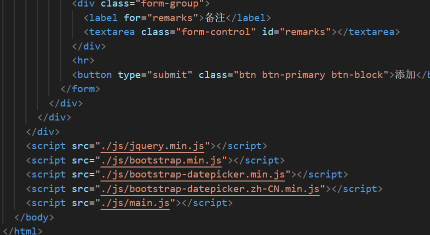


可以将js文件夹放到public文件夹下，然后将public文件夹指定为静态目录，最后将引入路径中的前置.删除就可以成功访问了


# 模板引擎

用于修改返回给客户端的**html页面**

一个页面往往样式是相同的，但内容要不断修改，使用模板引擎可以在样式上填充不同的内容


## 设置

要先安装**esj模块**

```js
//1. 设置 express 所使用的模板引擎 会根据这里的设置自动引入模板引擎，无需再写 require()
app.set('view engine', 'ejs');

//2. 设置模板文件的存放目录
app.set('views', path.join(__dirname, 'views'));
```


## 渲染


```js
app.get('/', function (req, res) {
  // 会在模板文件的存放目录中查找 index.ejs 文件 可以省略后缀和根目录，后面是填入到模板中的数据
  res.render('index', { title: 'Hey', message: 'Hello there!'});
});
```


## 语法

执行其中的**js代码**

```ejs
<% code %>

// 即使断开也没问题
<% top.forEach(item => { %>
    <tr>
        <td><%= item.id %></td>
        <td><%= item.name %></td>
        <td><%= item.money %> 亿美元</td>
    </tr>
<% }) %>
```

​	

输出内容，可以是运算结果

```ejs
<%= code %>
<p class="alert alert-warning">
    <%= Date.now() %> <br>
    <%= Math.random() %> <br>
    <%= 10 * 7 + 8 %> <br>
</p>
```

其中可以执行js代码


不进行转义

```python
<%- code %>
```


# Express 项目生成器  express-generator

直接帮助生成项目结构

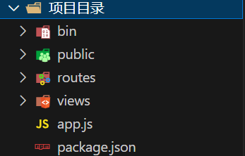


routes中是封装的路由模块，app.js中初始化了**express对象**，并做了一些准备，比如**错误处理**，**挂载路由**，**模板引擎**，**设置请求体**和**静态资源托管**等，最后将express**导出**。bin下的www文件是执行最终操作的，public中存放引入的css,js和图片文件


**全局安装：**

```shell
npm install -g express-generator
```

**运行命令生成目录结构并指定模板引擎为 ejs：**

```shell
express --view=ejs
```

**安装依赖:**

```shell
npm install
```

**启动项目：**

```shell
npm start
```

> 注意不要直接运行入口文件！


# lowdb

一个简单的暂时代替数据库的库

这里只是简单演示所以不会使用最新版本**npm i lowdb@1.0.0**


```JS
// 初始化lowdb对象
const low = require('lowdb')
const FileSync = require('lowdb/adapters/FileSync')

// 指定了数据会被存入db.json中
const adapter = new FileSync('db.json')
const db = low(adapter)

// 初始化 指定了存储的内容 如果db.json不存在会创建 可以手动在文件中修改 
db.defaults({ posts: [], user: {} }).write();

// 写入数据 create push将内容写到结尾 unshift将内容写到开头 修改类的操作最后要执行write 
db.get('posts').push({ id: 100, title: 'lowdb is awesome'}).write()
db.get('posts').unshift({ id: 101, title: 'lowdb is awesome'}).write()

// 改 update
db.set('posts[1].title', '高小乐').write();

// 读取 r
console.log(db.get('posts').value());

// 删除 
db.get('posts').remove({id:1}).write();
```


如果想给每一个数据添加一个唯一的id，需要使用**shortid**模块，**npm i shortid**


```js
const shortid = require('shortid')
router.post('/create', function (req, res, next) {
    const id = shortid()
    db.get('account').unshift({ id, ...req.body }).write()
    res.send(`<h1>添加成功</h1>`)
});
```


# 会话控制


## cookies

cookie本质是一个存储在浏览器的文本，随着http请求自动传递给服务器。

- 服务器以响应头的形式将如何设置 cookie 发送给浏览器。
- 浏览器收到以后会设置 cookie 并保存。
- 浏览器再次访问服务器时，会以请求头的形式将 cookie 发送。
- 服务器就可以通过检查浏览器发送的 cookie 来识别出不同的浏览器。


在 express 中，通过配置 `cookie-parser` 中间件，可以将 `cookie` 解析为一个对象，并为 `request` 对象添加了一些操作 cookie 属性方法。

**安装：**

```bash
npm install cookie-parser
```

**引入：**

```js
const cookieParser = require("cookie-parser");
```

**挂载中间件：**

```js
app.use(cookieParser());
```

**使用：**

```js
// 设置 cookie （添加或修改） 注意：cookie的属性设置使用小驼峰
res.cookie("userName","laoli");
res.cookie("age",18,{maxAge:20*1000});  // maxAge 单位是毫秒

// 读取 cookie 
req.cookies;  

// 删除 cookie
res.clearCookie("userName");
res.clearCookie("age",{path:"/login"});
```


## session

Session是一个对象，储存特定用户会话所需的**属性及配置信息**，**保存在服务器端**

Session运行原理

```
服务器为每一个会话创建一个对象。然后每个对象设置唯一一个ID
通过设置响应头让客户端设置设置cookie保存该ID
将会话中产生的信息都保存在服务器端的Session对象中，客户端只需保存一个ID即可
```


在 express 中，通过配置 `express-session` 中间件，可以将 `cookie` 解析为一个对象，并为 `request` 对象添加了一些操作 cookie 属性方法。

**安装：**

```bash
npm install express-session
```

**引入：**

```js
var session = require("express-session");
```

**挂载中间件：**

```js
app.use(session({
    name: 'sess',      // 设置cookie的name，默认值是：connect.sid
    secret: 'atguigu', // 用于加密唯一的ID
    saveUninitialized: false, //是否为每次请求都设置一个 cookie 用来存储 session 的 id
    resave: false ,// 强制保存 session 即使它并没有变化, 默认为 true,建议设置成 false。
    cookie: {
    	httpOnly: true, // 开启后前端无法通过 JS 操作
        maxAge: 1000*30 // 这一条 是控制 sessionID 的过期时间的！！！
    }
}));
```

**使用：**通过req的session对象 会自动解析请求的cookie然后选择对应的session

```js
app.get("/setSession",function (req,res){
    req.session.userName = "zhangsan";
    res.send("设置成功");
})
app.get("/getSession",function (req,res){
    console.log(req.session.userName)
    res.send("获取成功")
})
// 删除全部session 成功后会执行回调函数
app.get("/delSession",function (req,res){
    req.session.destroy(function (){
       res.send("删除成功");
    })
})
```


注意如果服务器**重启了(重新执行node命令)**那么储存的session信息会**失效**。


# 浏览器的同源策略

该策略限制一个源对另外一个源的**交互**，只有网页加载时的源和Ajax请求的源（**协议端口域名**）全部**相同**时才是同源，用于保护浏览器中**网站的安全**，限制 Ajax只能向**同源URL**发送请求


# 跨域

网页加载所在源和Ajax的源(**协议域名端口**)只要有一个不同，就发生了跨域访问，请求的访问会失败，会报出**CORS**错误，注意**浏览器直接访问（不通过JS）**不会被限制。

在前后端分离的项目中，**前后端不在一个源**如果不进行设置则无法得到数据

​			

解决方法是：在服务器端设置**Access-Control-Allow-Origin响应头字段**允许其他源可以访问自己的资源，首先要安装**cors软件包**

```javascript
const cors = require('cors')
server.use(cors())// 会设置响应头字段
```

或者设置


注意上述方法是在**开发阶段**使用，上线部署时需采用**同源访问**


# Webpack

是一个用于现代JS程序的静态模块打包工具，用于前端工程化，只有和入口文件有关联的的才会被操作

命令后缀**--save-dev**表示非全局下载，可以用**-D**替代


步骤如下：

+ 新建项目文件夹，初始化包环境
+ 项目文件夹下新建ssr文件夹，里面是主要逻辑代码，导出导入使用ECMA语法

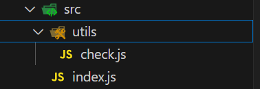


+ 下载webpack和webpack-cli——**npm i webpack webpack-cli --save-dev**这里不进行全局下载
+ 项目中运行工具命令，采用**自定义命令**的方式，在package.json中添加**"build":"webpack"** 然后执行命令**npm run build**，**build**可以自定义

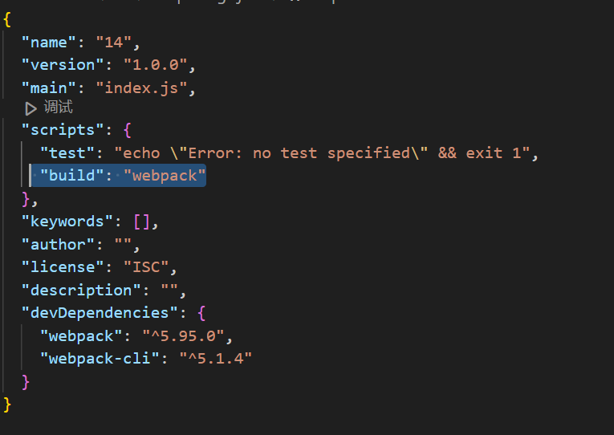

+ 会生成dist文件夹，存放最终结果的文件夹，内部有一个main.js即压缩和优化后的js文件，而**html行和css需要手动**放入dist


webpack的**默认入口是./src/index.js，默认的出口是./dist/main.js**，这是可以被修改的

+ 在项目根目录下新建webpack.config.js配置文件
+ 导出配置对象，配置入口出口文件路径

```javascript
// 导入模块
const path = require('path');

module.exports = {
    // 入口 webpack编译的是哪个主文件
    entry: './path/to/my/entry/file.js',
    // 出口 编译后生成的新文件创建到哪里
    output: {
        // 输出文件的位置
        path: path.resolve(__dirname, 'dist'),
        // 文件名
        filename: 'my-first-webpack.bundle.js',
        // 清空dist目录 可选
        clean: true
    },
};
```


手动导入html文件比较麻烦，可以插件帮助生成html文件

+ 下载插件**npm i html-webpack-plugin --save-dev**
+ 配置wenpack.config.js文件，在配置完成后，进行打包时会自动生成一个**导入了js**的html文件(放在public文件夹下)，且这个文件是**压缩**好的

```javascript
// 导入模块
const HtmlWebpackPlugin = require('html-webpack-plugin');
const path = require('path');

module.exports = {
    entry: './src/index.js',
    output: {
        path: path.resolve(__dirname, 'dist'),
        filename: 'main.js',
    }, 
    plugins: [ // 插件列表
    new HtmlWebpackPlugin({
      template: path.resolve(__dirname, 'public/index.html'), // 以指定的 html 文件作为生成模板
      minify: { // 添加 minify 配置来压缩 HTML
        collapseWhitespace: true, // 去掉空格
        removeComments: true, // 移除注释
        removeRedundantAttributes: true, // 删除冗余的属性，比如 <input type="text">
        removeScriptTypeAttributes: true, // 删除 <script> 标签中的 type="text/javascript"
        removeStyleLinkTypeAttributes: true, // 删除 <link> 标签中的 type="text/css"
        useShortDoctype: true, // 使用短的 DOCTYPE 替代完整的
      }
    })
  ],
};
```

## 打包CSS

打包CSS文件

+ 将CSS文件引入到入口文件中 使用**import**操作方法**import './css/index.css'** CSS文件一般放在**src下的CSS文件夹中** 
+ 下载相应的插件——**npm install --save-dev css-loader style-loader**

+ 配置webpack.config.js 文件让webpack有加载器的功能

 

```javascript
const path = require('path');
const HtmlWebpackPlugin = require('html-webpack-plugin');

module.exports = {
  entry: path.resolve(__dirname, 'src/index.js'), // 入口
  output: { // 出口
    path: path.resolve(__dirname, 'dist'),
    filename: 'app.js',
    clean: true // 先清空 dist，然后再输出最新内容
  },
  plugins: [ // 插件列表
    new HtmlWebpackPlugin({
      template: path.resolve(__dirname, 'public/index.html') // 以指定的 html 文件作为生成模板
    })
  ],
  module: {
    rules: [
      // test选择那个 user使用那个加载器 注意下面的顺序不能反
      { test: /\.css$/i, use: ["style-loader", "css-loader"] },
    ],
  },
};
```

## 打包

打包less

+ 将less引入到入口文件中 一般放在src下的**less**文件夹中 **导入方式与css一致**

+ 下载软件包 **npm i less less-loader --save-dev**
+ 配置webpack.config.js **{ test: /\.css$/i, use: ["style-loader", "css-loader","less-loader"] }**

## 打包图片

打包图片

+ 图片素材放在src下的assets中，在css或less文件中用图片修饰
+ 在文件入口中导入图片 例如**import img from './assets/logo.png'**，如果是在**less/css中修饰**的只要**导入了less/css就无需再导入图片**
+ 配置webpack.config.json文件 图片无需下载加载器

```javascript
{ // 针对资源模块（图片，字体文件，图标文件等）处理
    test: /\.(png|jpg|jpeg|gif)$/i,
    type: 'asset', // 根据文件大小（8KB）
    //小于：把文件转成 base64 打包进 js 文件中（减少网络请求次数）大于：文件复制到输出的目录下
    generator: { 
        // 输出文件时，路径+名字
        filename: 'assets/[hash][ext]'}
```

这样图片会被一起打包，较大的图片会放到dist下的assets中，较小的会被直接放入html中


# babel编译器

是一个javascript语法编译器，可以使js代码兼容低版本浏览器  ES6->ES5	


+ 下载babel babel-loader core本地软件包 **npm install -D babel-loader @babel/core @babel/preset-env**
+ 配置webpack.config.js文件

```javascript
{
    test: /\.m?js$/,
        exclude: /(node_modules|bower_components)/,
            use: {
                loader: 'babel-loader',
                    options: {
                        presets: ['@babel/preset-env'],
                    },
            },
},
```


# AXIOS

AXIOS也可以通过npm下载 **npm axios** 下载后的axios需要在js中导入 **import axios from 'axios'**


# Webpack热更新

当在开发过程中修改代码时，`webpack-dev-server` 会自动重新打包，**并在浏览器中实时反映修改**，但是该命令不会生成dist文件夹因为它将内容保存在内存中。

+ 下载软件包 npm i -D webpack-dev-server 
+ 配置自定义命令

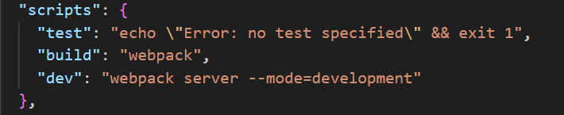


# 打包模式


这里压缩的代码指的是在dist下的js代码


在package.json中设置

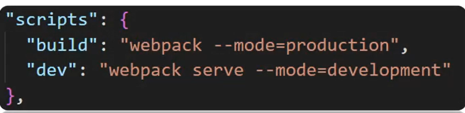


# 开发环境调错

代码被**压缩混淆**的时候无法正确定位到**源代码**的位置，可以在webpack.config.js中设置 **devtool: 'inline-source-map'**

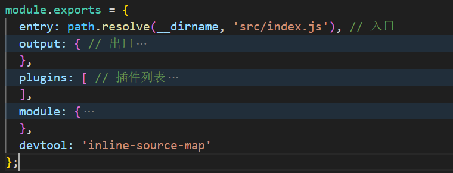


这样报错时的行数会定位到**源文件**中而不是打包后的**js文件**中


# 路径别名

在webpack.config.js中可以设置路径别名

```javascript
 resolve: {
    alias: {
      // 要设置的别名，注意替代的路径不能以/结尾，在其他文件中导入路径时可以用别名替代
      Myutils: path.resolve(__dirname, 'src/utils'),
      // 也可以是一个字符 
     '@': path.resolve(__dirname, 'src')
    },
  },
```

